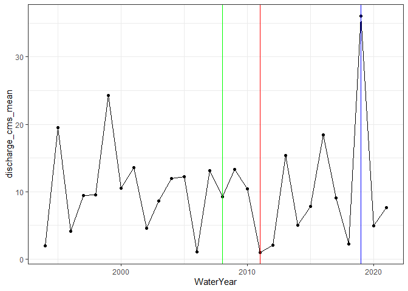
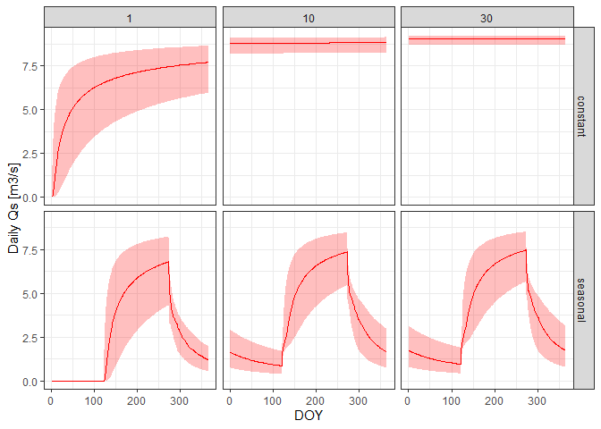
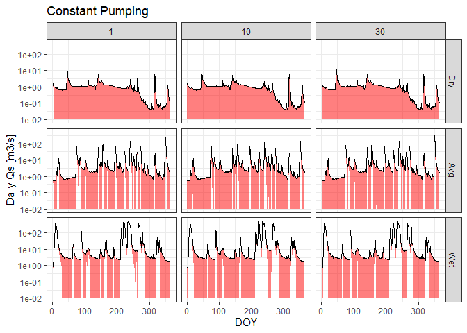
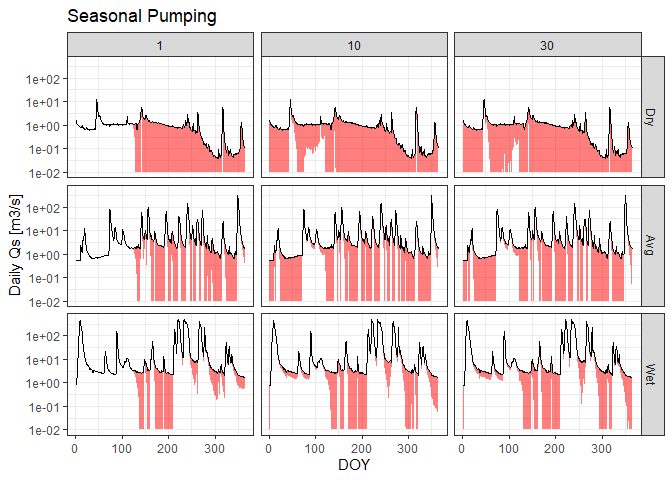

Apply calculated depletion to a gage
================

# Overview

This script is intended to apply the fractional streamflow depletion
(`Qf`) calculated in `CalculateDepletion.R` to long-term hydrologic data
from a gage.

# Set up workspace

``` r
## load packages
library(lubridate)
library(tidyverse)
library(patchwork)
library(dataRetrieval)
options(dplyr.summarise.inform=F)   # suppress summarize info

# directory to keep stuff that is too big for GitHub
dir_big_files <- "C:/Users/samzipper/OneDrive - The University of Kansas/Research/StreamflowDepletion/DepletionMetrics/data"
```

# Choose a gage and load streamflow and depletion data

``` r
# gage for testing
usgs_id <- "07144100"  # little arkansas river near Sedgwick

# load calculated depletion
daily_depletion_summary <- 
  file.path(dir_big_files, paste0("DepletionFraction_", usgs_id, "_DailySummary.csv")) %>% 
  read_csv() %>% 
  mutate(Year = ceiling(day/365),
         DOY = day-(Year-1)*365)
```

    ## Rows: 36500 Columns: 11

    ## -- Column specification --------------------------------------------------------
    ## Delimiter: ","
    ## chr  (1): pumping
    ## dbl (10): day, Qfmean, Qfsd, Qfmin, Qf5, Qf25, Qf50, Qf75, Qf95, Qfmax

    ## 
    ## i Use `spec()` to retrieve the full column specification for this data.
    ## i Specify the column types or set `show_col_types = FALSE` to quiet this message.

``` r
# load historic streamflow
daily_streamflow <- readNWISdv(siteNumbers = usgs_id, 
                               parameterCd = c("00060"),
                               statCd = "00003") %>% 
  mutate(WaterYear = year(Date + days(92)),
         discharge_cms = X_00060_00003*(0.3048^3))

# summarize mean annual by water year
annual_streamflow <- 
  daily_streamflow %>% 
  group_by(WaterYear) %>% 
  summarize(discharge_cms_mean = mean(discharge_cms),
            n_days = sum(is.finite(discharge_cms))) %>% 
  subset(n_days > 365*0.95) %>% 
  arrange(discharge_cms_mean)

# select dry, average, wet year
WaterYear_dry <- annual_streamflow$WaterYear[1]
WaterYear_avg <- annual_streamflow$WaterYear[round(length(annual_streamflow$WaterYear)/2)]
WaterYear_wet <- annual_streamflow$WaterYear[length(annual_streamflow$WaterYear)]
years_select <- tibble(WaterYear = c(WaterYear_dry, WaterYear_avg, WaterYear_wet),
                       FlowScenario = factor(c("Dry", "Avg", "Wet"), levels = c("Dry", "Avg", "Wet")))

# plot dry, average, and wet year
ggplot(annual_streamflow, aes(x = WaterYear, y = discharge_cms_mean)) +
  geom_point() + geom_line() +
  geom_vline(xintercept = years_select$WaterYear,
             color = c("red", "green", "blue")) +
  theme_bw()
```

<!-- -->

# calculate volumetric depletion

``` r
## set pump rate: median annual streamflow
pump_rate_cms <- median(annual_streamflow$discharge_cms_mean)
pump_vol_m3 <- pump_rate_cms*365.25

# years to plot
plot_years <- c(1, 10, 30)

# calculate depletion: multiply Qf by pump rate for selected years
depletion_plot_years <-
  daily_depletion_summary %>% 
  subset(Year %in% plot_years) %>% 
  mutate(Qs25 = Qf25*pump_rate_cms,
         Qs50 = Qf50*pump_rate_cms,
         Qs75 = Qf75*pump_rate_cms) %>% 
  dplyr::select(Year, DOY, pumping, starts_with("Qs"))

# plot volumetric depletion
ggplot(depletion_plot_years, aes(x = DOY)) +
  geom_ribbon(aes(ymin = Qs25, ymax = Qs75), fill = "red", alpha = 0.25) +
  geom_line(aes(y = Qs50), color = "red") +
  scale_y_continuous(name = "Daily Qs [m3/s]") +
  facet_grid(pumping~Year) +
  theme_bw()
```

<!-- --> #
apply volumetric depletion to dry, avg, wet years

``` r
# select streamflow for dry/avg/wet years
streamflow_plot_years <- 
  daily_streamflow %>% 
  left_join(years_select, by = "WaterYear") %>% 
  subset(!is.na(FlowScenario)) %>% 
  select(Date, WaterYear, discharge_cms, FlowScenario) %>% 
  mutate(DOY = yday(Date + days(92))) %>% 
  subset(DOY <= 365) # get rid of leap years

# join with calculated depletion
join_plot_years <- 
  full_join(depletion_plot_years, streamflow_plot_years, by = "DOY")

# calculate depleted discharge
depleted_plot_years <-
  join_plot_years %>% 
  mutate(discharge.Qs25 = discharge_cms-Qs25,
         discharge.Qs50 = discharge_cms-Qs50,
         discharge.Qs75 = discharge_cms-Qs75)

# set any streamflow less than 0 to 0.01 (for log plotting)
depleted_plot_years$discharge.Qs25[depleted_plot_years$discharge.Qs25 < 0.01] <- 0.01
depleted_plot_years$discharge.Qs50[depleted_plot_years$discharge.Qs50 < 0.01] <- 0.01
depleted_plot_years$discharge.Qs75[depleted_plot_years$discharge.Qs75 < 0.01] <- 0.01

# ribbon plot: discharge as top, depleted as bottom
depleted_plot_years %>% 
  subset(pumping == "constant") %>% 
  ggplot(aes(x = DOY)) +
  geom_ribbon(aes(ymin = discharge.Qs50, ymax = discharge_cms), fill = "red", alpha = 0.5) +
  geom_line(aes(y = discharge_cms)) +
  scale_y_continuous(name = "Daily Qs [m3/s]", trans = "log10") +
  facet_grid(FlowScenario~Year) +
  theme_bw() +
  labs(title = "Constant Pumping")
```

<!-- -->

``` r
depleted_plot_years %>% 
  subset(pumping == "seasonal") %>% 
  ggplot(aes(x = DOY)) +
  geom_ribbon(aes(ymin = discharge.Qs50, ymax = discharge_cms), fill = "red", alpha = 0.5) +
  geom_line(aes(y = discharge_cms)) +
  scale_y_continuous(name = "Daily Qs [m3/s]", trans = "log10") +
  facet_grid(FlowScenario~Year) +
  theme_bw() +
  labs(title = "Seasonal Pumping")
```

<!-- -->
