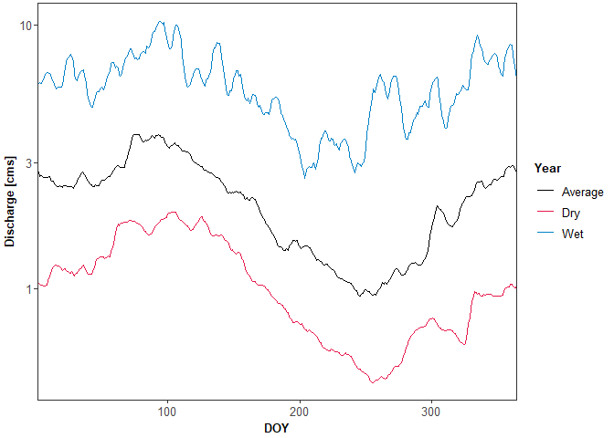
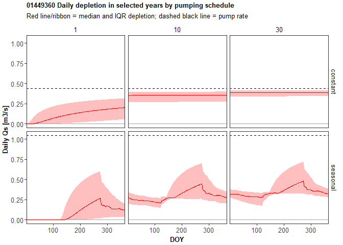
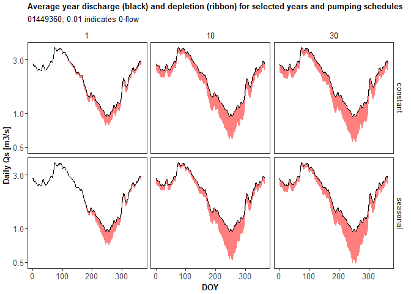

Apply calculated depletion to the synthetic hydrograph from a gage
================

# Overview

This script is intended to apply the fractional streamflow depletion
(`Qf`) calculated in `CalculateDepletion.R` to long-term hydrologic data
from a gage. Instead of picking ‘dry’, ‘average’, and ‘wet’ years, the
hydrograph is represented as the Q10, Q50, and Q90 for the gage.

# Set up workspace

``` r
## load packages
library(lubridate)
library(tidyverse)
library(patchwork)
library(dataRetrieval)
options(dplyr.summarise.inform=F)   # suppress summarize info

# directory to keep stuff that is too big for GitHub
dir_big_files <- "C:/Users/samzipper/OneDrive - The University of Kansas/Research/StreamflowDepletion/DepletionMetrics_LapidesEtAl/data"

## color palettes
# categorical color palette from https://sashat.me/2017/01/11/list-of-20-simple-distinct-colors/
col.cat.grn <- "#3cb44b"   # green
col.cat.yel <- "#ffe119"   # yellow
col.cat.org <- "#f58231"   # orange
col.cat.red <- "#e6194b"   # red
col.cat.blu <- "#0082c8"   # blue
col.gray <- "gray65"       # gray for annotation lines, etc

## ggplot theme
windowsFonts(Arial=windowsFont("TT Arial"))
theme_scz <- function(...){
  theme_bw(base_size=10, base_family="Arial") + 
    theme(
      text=element_text(color="black"),
      plot.title=element_text(face="bold", size=rel(1)),
      axis.title=element_text(face="bold", size=rel(1)),
      axis.text=element_text(size=rel(1)),
      strip.text=element_text(size=rel(1)),
      legend.title=element_text(face="bold", size=rel(1)),
      legend.text=element_text(size=rel(1)),
      panel.grid=element_blank(),
      plot.margin=unit(c(1,1,1,1), "mm"),
      strip.background=element_blank())
}

theme_set(theme_scz())
```

# Choose a gage and load streamflow and depletion data

``` r
# gage for testing
usgs_id <- "01449360"

# load calculated depletion
daily_depletion_summary <- 
  file.path(dir_big_files, paste0("DepletionFraction_", usgs_id, "_DailySummary.csv")) %>% 
  read_csv() %>% 
  mutate(Year = ceiling(day/365),
         DOY = day-(Year-1)*365)
```

    ## Rows: 36500 Columns: 11

    ## -- Column specification --------------------------------------------------------
    ## Delimiter: ","
    ## chr  (1): pumping
    ## dbl (10): day, Qfmean, Qfsd, Qfmin, Qf5, Qf25, Qf50, Qf75, Qf95, Qfmax

    ## 
    ## i Use `spec()` to retrieve the full column specification for this data.
    ## i Specify the column types or set `show_col_types = FALSE` to quiet this message.

``` r
# load historic streamflow percentiles - prepared by John
daily_streamflow <- 
  file.path(dir_big_files, "complete_years_data_q10_25_50", paste0(usgs_id, ".csv")) %>% 
  read_csv() %>% 
  subset(!(month_nu == 2 & day_nu == 29)) # leap year data averages over a different period - eliminate
```

    ## New names:
    ## * `` -> ...1

    ## Rows: 366 Columns: 26

    ## -- Column specification --------------------------------------------------------
    ## Delimiter: ","
    ## chr  (3): agency_cd, site_no, parameter_cd
    ## dbl (22): ...1, ts_id, month_nu, day_nu, begin_yr, end_yr, count_nu, max_va_...
    ## lgl  (1): loc_web_ds

    ## 
    ## i Use `spec()` to retrieve the full column specification for this data.
    ## i Specify the column types or set `show_col_types = FALSE` to quiet this message.

``` r
# column for DOY
daily_streamflow$DOY <- seq(1, 365)

# plot all percentiles
daily_streamflow %>% 
  select(DOY, starts_with("p"), -parameter_cd) %>% 
  pivot_longer(-DOY, values_to = "discharge") %>% 
  ggplot(aes(x = DOY, y = discharge, color = name)) +
  geom_line() +
  scale_x_continuous(name = "DOY", expand = c(0,0)) +
  scale_y_log10(name = "Discharge [???cms???]")
```

<!-- -->

# Select and plot dry, average, and wet year

``` r
# column names corresponding to dry, average, and wet
dry_name <- "p10_va" # q10
avg_name <- "p50_va" # q50
wet_name <- "p90_va" # q90

# select and organize into smaller data frame
daily_DAW <- 
  daily_streamflow %>% 
  dplyr::select(DOY, all_of(c(dry_name, avg_name, wet_name))) %>% 
  set_names("DOY", "Q_dry", "Q_avg", "Q_wet")

# plot
daily_DAW %>% 
  pivot_longer(-DOY, values_to = "discharge") %>% 
  ggplot(aes(x = DOY, y = discharge, color = name)) +
  geom_line() +
  scale_x_continuous(name = "DOY", expand = c(0,0)) +
  scale_y_log10(name = "Discharge [cms]") +
  scale_color_manual(name = "Year", 
                     values = c("Q_avg" = "black", "Q_dry" = col.cat.red, "Q_wet" = col.cat.blu),
                     labels = c("Q_avg" = "Average", "Q_dry" = "Dry", "Q_wet" = "Wet"))
```

<!-- -->

# Calculate volumetric depletion

``` r
## join streamflow with depletion summary
daily_depletion_with_Q <- left_join(daily_depletion_summary, daily_DAW, by = "DOY")

# inspect to make sure years are repeated correctly
#ggplot(subset(daily_depletion_with_Q, Year <= 5), aes(x = day, y = Q_dry)) + geom_line()

## set pump rate
pump_Q_fraction <- 0.2  # 20% of mean annual streamflow (based on withdrawal_fractions.xlsx sheet from John)
pump_rate_cms <- mean(daily_DAW$Q_avg)*pump_Q_fraction  # pump rate for constant pumping
pump_vol_m3 <- pump_rate_cms*365*24*60*60
seasonal_pump_days <- length(seq(yday(ymd("2021-05-01")), yday(ymd("2021-09-30"))))
pump_rate_cms_seasonal <- pump_vol_m3/(seasonal_pump_days*24*60*60)

# make a data frame so you can join it with the depletion data frame
# seasonal pump rate should be for every day since you will multiply by Qf (even when pumping is shut off)
df_pump_rate <- tibble(pumping = c("constant", "seasonal"),
                       Qw_cms = c(pump_rate_cms, pump_rate_cms_seasonal))

daily_depletion_with_Qs <- 
  left_join(daily_depletion_with_Q, df_pump_rate, by = c("pumping")) %>% 
  mutate(Qsmean = Qfmean*Qw_cms,
         Qssd = Qfsd*Qw_cms,
         Qsmin = Qfmin*Qw_cms,
         Qs5 = Qf5*Qw_cms,
         Qs25 = Qf25*Qw_cms,
         Qs50 = Qf50*Qw_cms,
         Qs75 = Qf75*Qw_cms,
         Qs95 = Qf95*Qw_cms,
         Qsmax = Qfmax*Qw_cms)

# years to plot
plot_years <- c(1, 10, 30)

# calculate depletion: multiply Qf by pump rate for selected years
depletion_plot_years <-
  daily_depletion_with_Qs %>% 
  subset(Year %in% plot_years) %>% 
  dplyr::select(Year, DOY, pumping, Qs25, Qs50, Qs75)

# plot volumetric depletion
ggplot(depletion_plot_years, aes(x = DOY)) +
  geom_hline(yintercept = 0, color = col.gray) +
  geom_hline(data = df_pump_rate, aes(yintercept = Qw_cms), linetype = "dashed") +
  geom_ribbon(aes(ymin = Qs25, ymax = Qs75), fill = "red", alpha = 0.25) +
  geom_line(aes(y = Qs50), color = "red") +
  scale_x_continuous(name = "DOY", expand = c(0,0)) +
  scale_y_continuous(name = "Daily Qs [m3/s]") +
  facet_grid(pumping~Year) +
  labs(title = paste0(usgs_id, " Daily depletion in selected years by pumping schedule"),
       subtitle = "Red line/ribbon = median and IQR depletion; dashed black line = pump rate")
```

<!-- -->

# apply volumetric depletion to dry, avg, wet years

``` r
# make a subtraction function that does not allow below 0
sub0 <- function(df, x, y, bound){
  new <- df[,x] - df[,y]
  new[new < bound] <- bound
  return(unlist(c(new)))
}
# test: 
#  ab = tibble(a = c(3, 5), b = c(2, 6))
#  sub0(ab, "a", "b", 0.01)

# calculate depleted streamflow
Qs_options <- names(daily_depletion_with_Qs)[str_detect(names(daily_depletion_with_Qs), "Qs")]
Q_options <- names(daily_depletion_with_Qs)[str_detect(names(daily_depletion_with_Qs), "Q_")]

for (Q in Q_options){
  for (Qs in Qs_options){
    varname <- paste0(Q, "_sub", Qs)
    daily_depletion_with_Qs$new <- sub0(daily_depletion_with_Qs, Q, Qs, bound = 0.01) # use 0.01 for log plotting
    names(daily_depletion_with_Qs)[names(daily_depletion_with_Qs) == "new"] <- varname
  }
}

## plot depleted streamflow for select years
daily_depletion_plot <- subset(daily_depletion_with_Qs, Year %in% plot_years)

# ribbon plot: discharge as top, depleted as bottom
daily_depletion_plot %>% 
  ggplot(aes(x = DOY)) +
  geom_ribbon(aes(ymin = Q_dry_subQs50, ymax = Q_dry), fill = "red", alpha = 0.5) +
  geom_line(aes(y = Q_dry)) +
  scale_y_continuous(name = "Daily Qs [m3/s]", trans = "log10") +
  facet_grid(pumping~Year) +
  labs(title = "Dry year discharge (black) and depletion (ribbon) for selected years and pumping schedules",
       subtitle = paste0(usgs_id, "; 0.01 indicates 0-flow"))
```

<!-- -->

``` r
daily_depletion_plot %>% 
  ggplot(aes(x = DOY)) +
  geom_ribbon(aes(ymin = Q_avg_subQs50, ymax = Q_avg), fill = "red", alpha = 0.5) +
  geom_line(aes(y = Q_avg)) +
  scale_y_continuous(name = "Daily Qs [m3/s]", trans = "log10") +
  facet_grid(pumping~Year) +
  labs(title = "Average year discharge (black) and depletion (ribbon) for selected years and pumping schedules",
       subtitle = paste0(usgs_id, "; 0.01 indicates 0-flow"))
```

<!-- -->

``` r
daily_depletion_plot %>% 
  ggplot(aes(x = DOY)) +
  geom_ribbon(aes(ymin = Q_avg_subQs50, ymax = Q_avg), fill = "red", alpha = 0.5) +
  geom_line(aes(y = Q_avg)) +
  scale_y_continuous(name = "Daily Qs [m3/s]", trans = "log10") +
  facet_grid(pumping~Year) +
  labs(title = "Wet year discharge (black) and depletion (ribbon) for selected years and pumping schedules",
       subtitle = paste0(usgs_id, "; 0.01 indicates 0-flow"))
```

<!-- -->
