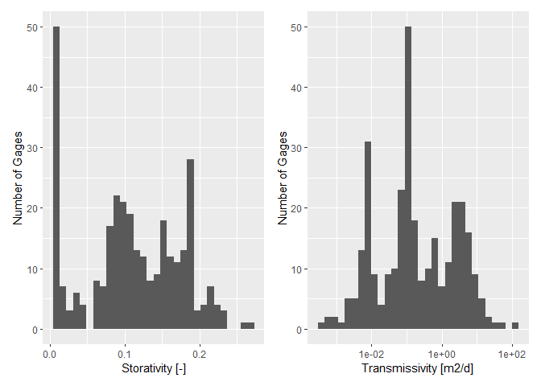
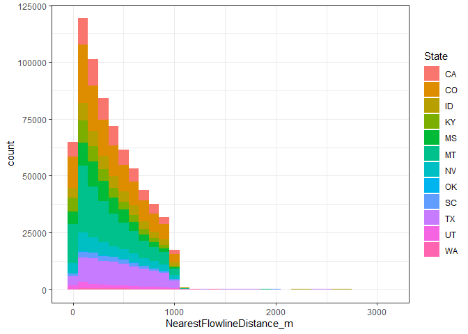
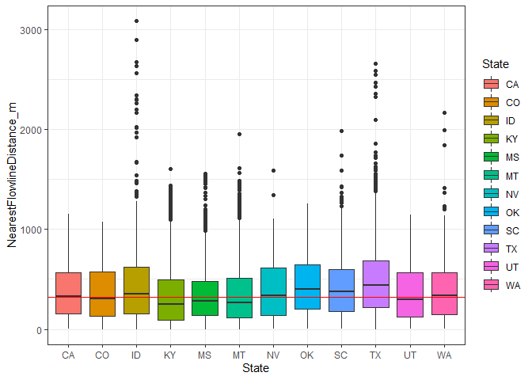
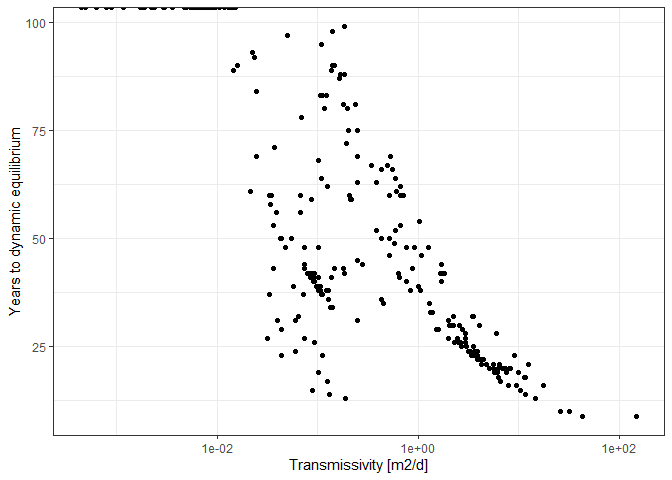
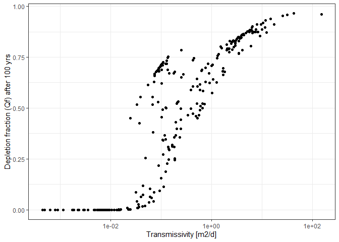
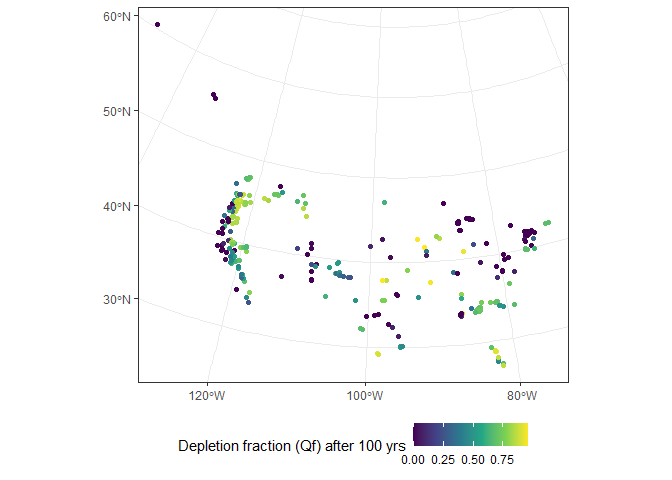

Depletion calculations
================

# Overview

This script is intended to calculate fractional streamflow depletion
(`Qf`) using the Glover model. `Qf` is depletion as a fraction of
pumping rate. To obtain volumetric streamflow depletion (`Qs`), multiply
`Qf` by the pumping rate (`Qw`). `Qs = Qf*Qw`

# Set up workspace

``` r
## load packages
library(streamDepletr)
library(lubridate)
library(tidyverse)
library(sf)
library(patchwork)
```

# Prep input data for model

``` r
## times to test
n_yrs <- 100
times <- seq(1, 365*n_yrs, 1)

## load aquifer characteristics
aquifer_params <- 
  read_csv(file.path("..", "Data", "GAGESII_aquifer_params.csv")) %>% 
  unique() %>% 
  mutate(Tr_m2d = Transmissivity*86400,
         S = Porosity) # any unit conversions if necessary
```

    ## New names:
    ## * `` -> ...1

    ## Rows: 311 Columns: 7

    ## -- Column specification --------------------------------------------------------
    ## Delimiter: ","
    ## chr (1): STANAME
    ## dbl (6): ...1, GAGE_ID, LAT_GAGE, LNG_GAGE, Porosity, Transmissivity

    ## 
    ## i Use `spec()` to retrieve the full column specification for this data.
    ## i Specify the column types or set `show_col_types = FALSE` to quiet this message.

``` r
# plot and inspect
p_S <-
  ggplot(aquifer_params, aes(x = S)) +
  geom_histogram() +
  scale_x_continuous(name = "Storativity [-]") +
  scale_y_continuous(name = "Number of Gages")

p_Tr <-
  ggplot(aquifer_params, aes(x = Tr_m2d)) +
  geom_histogram() +
  scale_x_log10(name = "Transmissivity [m2/d]") +
  scale_y_continuous(name = "Number of Gages")

p_S + p_Tr 
```

    ## `stat_bin()` using `bins = 30`. Pick better value with `binwidth`.

    ## `stat_bin()` using `bins = 30`. Pick better value with `binwidth`.

<!-- -->

# Use Jasechko et al data to determine well-stream distance

``` r
## load well-stream distances
jsko_files <- list.files(file.path("..", "Data", "JasechkoEtAl_Fig2Data"), pattern = ".csv")
for (f in jsko_files){
  # compile all individual states into one data frame
  state <- gsub(".csv", "", f)
  jsko_state_data <- 
    file.path("..", "Data", "JasechkoEtAl_Fig2Data", f) %>% 
    read_csv() %>% 
    mutate(State = state)
  
  if (f == jsko_files[1]){
    jsko_all_states <- jsko_state_data
  } else {
    jsko_all_states <- bind_rows(jsko_all_states, jsko_state_data)
  }
}

# get median by state and overall
median_dist_m <- median(jsko_all_states$NearestFlowlineDistance_m)
jsko_all_states %>% 
  group_by(State) %>% 
  summarize(median_dist_m = median(NearestFlowlineDistance_m))
```

    ## # A tibble: 12 x 2
    ##    State median_dist_m
    ##    <chr>         <dbl>
    ##  1 CA             329.
    ##  2 CO             308.
    ##  3 ID             352.
    ##  4 KY             246.
    ##  5 MS             283.
    ##  6 MT             269.
    ##  7 NV             340.
    ##  8 OK             399.
    ##  9 SC             375.
    ## 10 TX             437.
    ## 11 UT             296.
    ## 12 WA             339.

``` r
# plot distribution
ggplot(jsko_all_states, aes(x = NearestFlowlineDistance_m)) +
  geom_histogram(aes(fill = State), binwidth = 100) +
  theme_bw() 
```

<!-- -->

``` r
ggplot(jsko_all_states, aes(x = State, y = NearestFlowlineDistance_m)) +
  geom_boxplot(aes(fill = State)) +
  geom_hline(yintercept = median_dist_m, color = "red") +
  theme_bw()
```

<!-- -->

# Depletion calculation for each gage

``` r
## loop through all gages
# can we subset this? are we using all gages?
for (usgs_id in aquifer_params$GAGE_ID){
  # usgs_id <- "07144780"  # 8-digit USGS gage ID
  
  ## glover model inputs
  # Well-stream distance [m]
  # this is the median well-stream distance from all wells in 12 states with data shared from Jasechko et al.
  # the median of all wells is 318 m. the lowest state median is KY (246 m) and the highest is TX (437 m).
  # could use the data to randomly sample from a distribution for uncertainty analysis.
  gage_d  <- median_dist_m
  
  # Storativity [-]
  # since GLHYMPS gives porosity, may want to reduce to represent storativity since not all porosity
  # is drainable. however, de Graaf et al. 2015 HESS and 2017 ADWR use these values directly for their models.
  gage_S  <- aquifer_params$S[aquifer_params$GAGE_ID == usgs_id]
  
  # Aquifer transmissivity [m2/d]
  # multiply by 86,400 to convert to m2/d
  gage_Tr <- aquifer_params$Tr_m2d[aquifer_params$GAGE_ID == usgs_id]
  
  ## calculate depletion
  # constant pumping
  Qf_constant <- glover(t = times, d = gage_d, S = gage_S, Tr = gage_Tr)  # plot(times, Qf_constant)
  
  # seasonal pumping (may-sept)
  times_start <- seq(yday(ymd("2021-05-01")), yday(ymd("2021-05-01"))+365*n_yrs, 365)
  times_stop <- seq(yday(ymd("2021-09-30")), yday(ymd("2021-09-30"))+365*n_yrs, 365)
  Qf_seasonal <- intermittent_pumping(t = times, starts = times_start, stops = times_stop, rates = 1, 
                                      method = "glover", d = gage_d, S = gage_S, Tr = gage_Tr)  # plot(times, Qf_seasonal)
  
  ## summarize data
  daily_depletion <- tibble(day = times,
                            year = rep(seq(1, n_yrs, 1), each = 365),
                            DOY = rep(seq(1, 365, 1), times = n_yrs),
                            Qf_constant = round(Qf_constant, 3),
                            Qf_seasonal = round(Qf_seasonal, 3))
  
  ## calculate annual depletion
  annual_depletion <- 
    daily_depletion %>% 
    dplyr::group_by(year) %>% 
    dplyr::summarize(Qf_constant_sum = sum(Qf_constant),
                     Qf_seasonal_sum = sum(Qf_seasonal))
  
  ## figure out years to dynamic equilibrium
  eq_thres <- 0.01  # 1% change in annual depletion volume
  prc_change_constant <- c(NA, diff(annual_depletion$Qf_constant_sum))/annual_depletion$Qf_constant_sum
  prc_change_seasonal <- c(NA, diff(annual_depletion$Qf_seasonal_sum))/annual_depletion$Qf_seasonal_sum
  eq_yrs_constant <- min(annual_depletion$year[which(prc_change_constant < eq_thres)])
  eq_yrs_seasonal <- min(annual_depletion$year[which(prc_change_seasonal < eq_thres)])
  
  ## summarize output data to save
  gage_summary <- tibble(GAGE_ID = usgs_id,
                         dist_m = gage_d,
                         S = gage_S,
                         Tr_m2d = gage_Tr,
                         eq_yrs_constant = eq_yrs_constant,
                         eq_yrs_seasonal = eq_yrs_seasonal,
                         Qf_100yrs_constant = daily_depletion$Qf_constant[length(times)])
  
  ## compile data frame
  if (usgs_id == aquifer_params$GAGE_ID[1]){
    gage_depletion_summary <- gage_summary
  } else {
    gage_depletion_summary <- bind_rows(gage_depletion_summary, gage_summary)
  }
  
  ## save daily output - one file per gage
  ## uncomment if you want to write output
  #daily_depletion %>% 
  #  subset(year <= max(c(eq_yrs_constant, eq_yrs_seasonal))) %>% 
  #  dplyr::select(day, Qf_constant, Qf_seasonal) %>% 
  #  write_csv(file.path("..", "Data", "depletion", paste0("DepletionFraction_", usgs_id, "_Daily.csv")))
  
  ## status update
  # print(paste0(which(aquifer_params$GAGE_ID == usgs_id), " complete, ", Sys.time()))
}

## save summary
gage_depletion_summary %>% 
  write_csv(file.path("..", "Data", "depletion", "DepletionFraction_EqTime.csv"))
```

# Inspect and visualize

``` r
## inspect and visualize
ggplot(gage_depletion_summary, aes(x = Tr_m2d, y = eq_yrs_constant)) +
  geom_point() +
  scale_x_continuous(name = "Transmissivity [m2/d]", trans = "log10") +
  scale_y_continuous(name = "Years to dynamic equilibrium") +
  theme_bw()
```

<!-- -->

``` r
ggplot(gage_depletion_summary, aes(x = Tr_m2d, y = Qf_100yrs_constant)) +
  geom_point() +
  scale_x_continuous(name = "Transmissivity [m2/d]", trans = "log10") +
  scale_y_continuous(name = "Depletion fraction (Qf) after 100 yrs") +
  theme_bw()
```

<!-- -->

``` r
## make maps

# load shapefile
sf_gages <- 
  file.path("..", "Data", "gagesII_data_and_subsets", "gagesII.shp") %>% 
  st_read() %>% 
  mutate(GAGE_ID = as.numeric(STAID)) %>% 
  subset(GAGE_ID %in% gage_depletion_summary$GAGE_ID) %>% 
  left_join(gage_depletion_summary, by = "GAGE_ID")
```

    ## Reading layer `gagesII' from data source 
    ##   `C:\Users\samzipper\WorkGits\streamflow_depletion_metrics_replacement\Data\gagesII_data_and_subsets\gagesII.shp' 
    ##   using driver `ESRI Shapefile'
    ## Simple feature collection with 311 features and 14 fields
    ## Geometry type: POINT
    ## Dimension:     XY
    ## Bounding box:  xmin: -3129692 ymin: 539780.8 xmax: 2001508 ymax: 5013661
    ## Projected CRS: NAD_1983_Albers

``` r
# map
ggplot(sf_gages, aes(color = eq_yrs_constant)) +
  geom_sf() +
  scale_color_viridis_c(name = "Years to dynamic equilibrium") +
  theme_bw() +
  theme(legend.position = "bottom")
```

<!-- -->

``` r
ggplot(sf_gages, aes(color = Qf_100yrs_constant)) +
  geom_sf() +
  scale_color_viridis_c(name = "Depletion fraction (Qf) after 100 yrs") +
  theme_bw() +
  theme(legend.position = "bottom")
```

<!-- -->

``` r
## output stats
sum(gage_depletion_summary$Qf_100yrs_constant < 0.1, na.rm = T)
```

    ## [1] 91

``` r
sum(gage_depletion_summary$eq_yrs_constant < 50, na.rm = T)
```

    ## [1] 176
