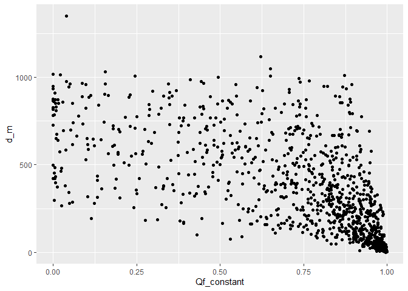

Depletion calculations for temperature paper
================

# Overview

This script is intended to calculate fractional streamflow depletion
(`Qf`) using the Glover model. `Qf` is depletion as a fraction of
pumping rate. To obtain volumetric streamflow depletion (`Qs`), multiply
`Qf` by the pumping rate (`Qw`). `Qs = Qf*Qw`

# Set up workspace

``` r
## load packages
library(streamDepletr)
library(lubridate)
library(tidyverse)
library(sf)
library(patchwork)
options(dplyr.summarise.inform=F)   # suppress summarize info
```

# Prep input data for model

``` r
## times to test
n_yrs <- 50
times <- seq(1, 365*n_yrs, 1)

# for seasonal pumping, start/stop times
times_start <- seq(yday(ymd("2021-05-01")), yday(ymd("2021-05-01"))+365*n_yrs, 365)
times_stop <- seq(yday(ymd("2021-09-30")), yday(ymd("2021-09-30"))+365*n_yrs, 365)

## load well-stream distances
jsko_files <- list.files(file.path("..", "Data", "JasechkoEtAl_Fig2Data"), pattern = ".csv")
for (f in jsko_files){
  # compile all individual states into one data frame
  state <- gsub(".csv", "", f)
  jsko_state_data <- 
    file.path("..", "Data", "JasechkoEtAl_Fig2Data", f) %>% 
    read_csv() %>% 
    mutate(State = state)
  
  if (f == jsko_files[1]){
    jsko_all_states <- jsko_state_data
  } else {
    jsko_all_states <- bind_rows(jsko_all_states, jsko_state_data)
  }
}
```

    ## Rows: 74597 Columns: 13
    ## ── Column specification ────────────────────────────────────────────────────────
    ## Delimiter: ","
    ## dbl (13): COMID, siteID, WellWaterDepth_m, NearestFlowlineDistance_m, NearSt...
    ## 
    ## ℹ Use `spec()` to retrieve the full column specification for this data.
    ## ℹ Specify the column types or set `show_col_types = FALSE` to quiet this message.
    ## Rows: 138141 Columns: 13
    ## ── Column specification ────────────────────────────────────────────────────────
    ## Delimiter: ","
    ## dbl (13): COMID, siteID, WellWaterDepth_m, NearestFlowlineDistance_m, NearSt...
    ## 
    ## ℹ Use `spec()` to retrieve the full column specification for this data.
    ## ℹ Specify the column types or set `show_col_types = FALSE` to quiet this message.
    ## Rows: 49367 Columns: 13
    ## ── Column specification ────────────────────────────────────────────────────────
    ## Delimiter: ","
    ## dbl (13): COMID, siteID, WellWaterDepth_m, NearestFlowlineDistance_m, NearSt...
    ## 
    ## ℹ Use `spec()` to retrieve the full column specification for this data.
    ## ℹ Specify the column types or set `show_col_types = FALSE` to quiet this message.
    ## Rows: 44822 Columns: 13
    ## ── Column specification ────────────────────────────────────────────────────────
    ## Delimiter: ","
    ## dbl (13): COMID, siteID, WellWaterDepth_m, NearestFlowlineDistance_m, NearSt...
    ## 
    ## ℹ Use `spec()` to retrieve the full column specification for this data.
    ## ℹ Specify the column types or set `show_col_types = FALSE` to quiet this message.
    ## Rows: 59229 Columns: 13
    ## ── Column specification ────────────────────────────────────────────────────────
    ## Delimiter: ","
    ## dbl (13): COMID, siteID, WellWaterDepth_m, NearestFlowlineDistance_m, NearSt...
    ## 
    ## ℹ Use `spec()` to retrieve the full column specification for this data.
    ## ℹ Specify the column types or set `show_col_types = FALSE` to quiet this message.
    ## Rows: 145511 Columns: 13
    ## ── Column specification ────────────────────────────────────────────────────────
    ## Delimiter: ","
    ## dbl (13): COMID, siteID, WellWaterDepth_m, NearestFlowlineDistance_m, NearSt...
    ## 
    ## ℹ Use `spec()` to retrieve the full column specification for this data.
    ## ℹ Specify the column types or set `show_col_types = FALSE` to quiet this message.
    ## Rows: 49608 Columns: 13
    ## ── Column specification ────────────────────────────────────────────────────────
    ## Delimiter: ","
    ## dbl (13): COMID, siteID, WellWaterDepth_m, NearestFlowlineDistance_m, NearSt...
    ## 
    ## ℹ Use `spec()` to retrieve the full column specification for this data.
    ## ℹ Specify the column types or set `show_col_types = FALSE` to quiet this message.
    ## Rows: 1461 Columns: 13
    ## ── Column specification ────────────────────────────────────────────────────────
    ## Delimiter: ","
    ## dbl (13): COMID, siteID, WellWaterDepth_m, NearestFlowlineDistance_m, NearSt...
    ## 
    ## ℹ Use `spec()` to retrieve the full column specification for this data.
    ## ℹ Specify the column types or set `show_col_types = FALSE` to quiet this message.
    ## Rows: 17288 Columns: 13
    ## ── Column specification ────────────────────────────────────────────────────────
    ## Delimiter: ","
    ## dbl (13): COMID, siteID, WellWaterDepth_m, NearestFlowlineDistance_m, NearSt...
    ## 
    ## ℹ Use `spec()` to retrieve the full column specification for this data.
    ## ℹ Specify the column types or set `show_col_types = FALSE` to quiet this message.
    ## Rows: 89655 Columns: 13
    ## ── Column specification ────────────────────────────────────────────────────────
    ## Delimiter: ","
    ## dbl (13): COMID, siteID, WellWaterDepth_m, NearestFlowlineDistance_m, NearSt...
    ## 
    ## ℹ Use `spec()` to retrieve the full column specification for this data.
    ## ℹ Specify the column types or set `show_col_types = FALSE` to quiet this message.
    ## Rows: 14101 Columns: 13
    ## ── Column specification ────────────────────────────────────────────────────────
    ## Delimiter: ","
    ## dbl (13): COMID, siteID, WellWaterDepth_m, NearestFlowlineDistance_m, NearSt...
    ## 
    ## ℹ Use `spec()` to retrieve the full column specification for this data.
    ## ℹ Specify the column types or set `show_col_types = FALSE` to quiet this message.
    ## Rows: 3552 Columns: 13
    ## ── Column specification ────────────────────────────────────────────────────────
    ## Delimiter: ","
    ## dbl (13): COMID, siteID, WellWaterDepth_m, NearestFlowlineDistance_m, NearSt...
    ## 
    ## ℹ Use `spec()` to retrieve the full column specification for this data.
    ## ℹ Specify the column types or set `show_col_types = FALSE` to quiet this message.

``` r
## define transmissivity parameters
# from Zell & Sanford (2020) Fig 6f: log(Ts) ~normally distributed from 0-3 m2/d
# use mean of 1.5 and sd of 0.75
logTmean <- 1.5
logTsd <- 0.75

## define storativity parameters
# from Gleeson et al. (2014) Table 1: unconsolidated and sedimentary porosities range from 0.12 to 0.28
# use mean of 0.2 and sd of 0.04
Smean <- 0.2
Ssd <- 0.04
```

# Sample 100 parameter sets

``` r
set.seed(1)
n_iter <- 1000
gage_d_sample <- sample(jsko_all_states$NearestFlowlineDistance_m, size = n_iter)
gage_S_sample <- rnorm(n_iter, mean = Smean, sd = Ssd)
gage_logT_sample <- rnorm(n_iter, mean = logTmean, sd = logTsd)

# combine into data frame
df_sample <- data.frame(iter = 1:n_iter,
                        d_m = gage_d_sample,
                        S = gage_S_sample,
                        logT_m2d = gage_logT_sample)

# plot
df_sample |> 
  pivot_longer(-iter, names_to = "parameter", values_to = "value") |> 
  ggplot(aes(x = value)) +
  stat_ecdf() +
  facet_wrap(~parameter, scales = "free")
```

<!-- -->

# Depletion calculation for each gage

``` r
## loop through each parameter set
for (n in 1:n_iter){
  
  ## loop through iterations and calculate depletion
    ## get parameters for this sample
    n_d <- round(gage_d_sample[n], 3)
    n_S <- round(gage_S_sample[n], 3)
    n_Tr <- 10^gage_logT_sample[n]
    
    ## calculate depletion
    # constant pumping
    Qf_constant <- glover(t = times, d = n_d, S = n_S, Tr = n_Tr)
    # plot(times, Qf_constant)
    
    # seasonal pumping (may-sept)
    Qf_seasonal <- intermittent_pumping(t = times, starts = times_start, stops = times_stop, rates = 1, 
                                        method = "glover", d = n_d, S = n_S, Tr = n_Tr)
    # plot(times, Qf_seasonal)
    
    ## summarize data
    daily_iter_depletion <- tibble(iter = n,
                                   day = times,
                                   Qf_constant = round(Qf_constant, 3),
                                   Qf_seasonal = round(Qf_seasonal, 3))
          
    ## compile data frame
    if (n == 1){
      daily_depletion <- daily_iter_depletion
    } else {
      daily_depletion <- bind_rows(daily_depletion, daily_iter_depletion)
    }
  
  ## status update
  print(paste0(n, " of ", n_iter, " complete, ", Sys.time()))
}
```

    ## [1] "1 of 1000 complete, 2023-07-25 17:10:09"
    ## [1] "2 of 1000 complete, 2023-07-25 17:10:09"
    ## [1] "3 of 1000 complete, 2023-07-25 17:10:09"
    ## [1] "4 of 1000 complete, 2023-07-25 17:10:10"
    ## [1] "5 of 1000 complete, 2023-07-25 17:10:10"
    ## [1] "6 of 1000 complete, 2023-07-25 17:10:10"
    ## [1] "7 of 1000 complete, 2023-07-25 17:10:10"
    ## [1] "8 of 1000 complete, 2023-07-25 17:10:11"
    ## [1] "9 of 1000 complete, 2023-07-25 17:10:11"
    ## [1] "10 of 1000 complete, 2023-07-25 17:10:11"
    ## [1] "11 of 1000 complete, 2023-07-25 17:10:11"
    ## [1] "12 of 1000 complete, 2023-07-25 17:10:11"
    ## [1] "13 of 1000 complete, 2023-07-25 17:10:12"
    ## [1] "14 of 1000 complete, 2023-07-25 17:10:12"
    ## [1] "15 of 1000 complete, 2023-07-25 17:10:12"
    ## [1] "16 of 1000 complete, 2023-07-25 17:10:12"
    ## [1] "17 of 1000 complete, 2023-07-25 17:10:12"
    ## [1] "18 of 1000 complete, 2023-07-25 17:10:13"
    ## [1] "19 of 1000 complete, 2023-07-25 17:10:13"
    ## [1] "20 of 1000 complete, 2023-07-25 17:10:13"
    ## [1] "21 of 1000 complete, 2023-07-25 17:10:13"
    ## [1] "22 of 1000 complete, 2023-07-25 17:10:13"
    ## [1] "23 of 1000 complete, 2023-07-25 17:10:14"
    ## [1] "24 of 1000 complete, 2023-07-25 17:10:14"
    ## [1] "25 of 1000 complete, 2023-07-25 17:10:14"
    ## [1] "26 of 1000 complete, 2023-07-25 17:10:14"
    ## [1] "27 of 1000 complete, 2023-07-25 17:10:14"
    ## [1] "28 of 1000 complete, 2023-07-25 17:10:14"
    ## [1] "29 of 1000 complete, 2023-07-25 17:10:15"
    ## [1] "30 of 1000 complete, 2023-07-25 17:10:15"
    ## [1] "31 of 1000 complete, 2023-07-25 17:10:15"
    ## [1] "32 of 1000 complete, 2023-07-25 17:10:15"
    ## [1] "33 of 1000 complete, 2023-07-25 17:10:15"
    ## [1] "34 of 1000 complete, 2023-07-25 17:10:16"
    ## [1] "35 of 1000 complete, 2023-07-25 17:10:16"
    ## [1] "36 of 1000 complete, 2023-07-25 17:10:16"
    ## [1] "37 of 1000 complete, 2023-07-25 17:10:16"
    ## [1] "38 of 1000 complete, 2023-07-25 17:10:16"
    ## [1] "39 of 1000 complete, 2023-07-25 17:10:16"
    ## [1] "40 of 1000 complete, 2023-07-25 17:10:16"
    ## [1] "41 of 1000 complete, 2023-07-25 17:10:17"
    ## [1] "42 of 1000 complete, 2023-07-25 17:10:17"
    ## [1] "43 of 1000 complete, 2023-07-25 17:10:17"
    ## [1] "44 of 1000 complete, 2023-07-25 17:10:17"
    ## [1] "45 of 1000 complete, 2023-07-25 17:10:17"
    ## [1] "46 of 1000 complete, 2023-07-25 17:10:18"
    ## [1] "47 of 1000 complete, 2023-07-25 17:10:18"
    ## [1] "48 of 1000 complete, 2023-07-25 17:10:18"
    ## [1] "49 of 1000 complete, 2023-07-25 17:10:18"
    ## [1] "50 of 1000 complete, 2023-07-25 17:10:18"
    ## [1] "51 of 1000 complete, 2023-07-25 17:10:18"
    ## [1] "52 of 1000 complete, 2023-07-25 17:10:18"
    ## [1] "53 of 1000 complete, 2023-07-25 17:10:18"
    ## [1] "54 of 1000 complete, 2023-07-25 17:10:19"
    ## [1] "55 of 1000 complete, 2023-07-25 17:10:19"
    ## [1] "56 of 1000 complete, 2023-07-25 17:10:19"
    ## [1] "57 of 1000 complete, 2023-07-25 17:10:19"
    ## [1] "58 of 1000 complete, 2023-07-25 17:10:19"
    ## [1] "59 of 1000 complete, 2023-07-25 17:10:19"
    ## [1] "60 of 1000 complete, 2023-07-25 17:10:20"
    ## [1] "61 of 1000 complete, 2023-07-25 17:10:20"
    ## [1] "62 of 1000 complete, 2023-07-25 17:10:20"
    ## [1] "63 of 1000 complete, 2023-07-25 17:10:20"
    ## [1] "64 of 1000 complete, 2023-07-25 17:10:20"
    ## [1] "65 of 1000 complete, 2023-07-25 17:10:21"
    ## [1] "66 of 1000 complete, 2023-07-25 17:10:21"
    ## [1] "67 of 1000 complete, 2023-07-25 17:10:21"
    ## [1] "68 of 1000 complete, 2023-07-25 17:10:21"
    ## [1] "69 of 1000 complete, 2023-07-25 17:10:21"
    ## [1] "70 of 1000 complete, 2023-07-25 17:10:22"
    ## [1] "71 of 1000 complete, 2023-07-25 17:10:22"
    ## [1] "72 of 1000 complete, 2023-07-25 17:10:22"
    ## [1] "73 of 1000 complete, 2023-07-25 17:10:22"
    ## [1] "74 of 1000 complete, 2023-07-25 17:10:23"
    ## [1] "75 of 1000 complete, 2023-07-25 17:10:23"
    ## [1] "76 of 1000 complete, 2023-07-25 17:10:23"
    ## [1] "77 of 1000 complete, 2023-07-25 17:10:23"
    ## [1] "78 of 1000 complete, 2023-07-25 17:10:23"
    ## [1] "79 of 1000 complete, 2023-07-25 17:10:24"
    ## [1] "80 of 1000 complete, 2023-07-25 17:10:24"
    ## [1] "81 of 1000 complete, 2023-07-25 17:10:24"
    ## [1] "82 of 1000 complete, 2023-07-25 17:10:24"
    ## [1] "83 of 1000 complete, 2023-07-25 17:10:25"
    ## [1] "84 of 1000 complete, 2023-07-25 17:10:25"
    ## [1] "85 of 1000 complete, 2023-07-25 17:10:25"
    ## [1] "86 of 1000 complete, 2023-07-25 17:10:25"
    ## [1] "87 of 1000 complete, 2023-07-25 17:10:25"
    ## [1] "88 of 1000 complete, 2023-07-25 17:10:26"
    ## [1] "89 of 1000 complete, 2023-07-25 17:10:26"
    ## [1] "90 of 1000 complete, 2023-07-25 17:10:26"
    ## [1] "91 of 1000 complete, 2023-07-25 17:10:26"
    ## [1] "92 of 1000 complete, 2023-07-25 17:10:27"
    ## [1] "93 of 1000 complete, 2023-07-25 17:10:27"
    ## [1] "94 of 1000 complete, 2023-07-25 17:10:27"
    ## [1] "95 of 1000 complete, 2023-07-25 17:10:27"
    ## [1] "96 of 1000 complete, 2023-07-25 17:10:27"
    ## [1] "97 of 1000 complete, 2023-07-25 17:10:28"
    ## [1] "98 of 1000 complete, 2023-07-25 17:10:28"
    ## [1] "99 of 1000 complete, 2023-07-25 17:10:28"
    ## [1] "100 of 1000 complete, 2023-07-25 17:10:28"
    ## [1] "101 of 1000 complete, 2023-07-25 17:10:29"
    ## [1] "102 of 1000 complete, 2023-07-25 17:10:29"
    ## [1] "103 of 1000 complete, 2023-07-25 17:10:29"
    ## [1] "104 of 1000 complete, 2023-07-25 17:10:29"
    ## [1] "105 of 1000 complete, 2023-07-25 17:10:29"
    ## [1] "106 of 1000 complete, 2023-07-25 17:10:29"
    ## [1] "107 of 1000 complete, 2023-07-25 17:10:30"
    ## [1] "108 of 1000 complete, 2023-07-25 17:10:30"
    ## [1] "109 of 1000 complete, 2023-07-25 17:10:30"
    ## [1] "110 of 1000 complete, 2023-07-25 17:10:30"
    ## [1] "111 of 1000 complete, 2023-07-25 17:10:30"
    ## [1] "112 of 1000 complete, 2023-07-25 17:10:31"
    ## [1] "113 of 1000 complete, 2023-07-25 17:10:31"
    ## [1] "114 of 1000 complete, 2023-07-25 17:10:31"
    ## [1] "115 of 1000 complete, 2023-07-25 17:10:31"
    ## [1] "116 of 1000 complete, 2023-07-25 17:10:31"
    ## [1] "117 of 1000 complete, 2023-07-25 17:10:32"
    ## [1] "118 of 1000 complete, 2023-07-25 17:10:32"
    ## [1] "119 of 1000 complete, 2023-07-25 17:10:32"
    ## [1] "120 of 1000 complete, 2023-07-25 17:10:32"
    ## [1] "121 of 1000 complete, 2023-07-25 17:10:32"
    ## [1] "122 of 1000 complete, 2023-07-25 17:10:33"
    ## [1] "123 of 1000 complete, 2023-07-25 17:10:33"
    ## [1] "124 of 1000 complete, 2023-07-25 17:10:33"
    ## [1] "125 of 1000 complete, 2023-07-25 17:10:33"
    ## [1] "126 of 1000 complete, 2023-07-25 17:10:33"
    ## [1] "127 of 1000 complete, 2023-07-25 17:10:33"
    ## [1] "128 of 1000 complete, 2023-07-25 17:10:34"
    ## [1] "129 of 1000 complete, 2023-07-25 17:10:34"
    ## [1] "130 of 1000 complete, 2023-07-25 17:10:34"
    ## [1] "131 of 1000 complete, 2023-07-25 17:10:34"
    ## [1] "132 of 1000 complete, 2023-07-25 17:10:34"
    ## [1] "133 of 1000 complete, 2023-07-25 17:10:34"
    ## [1] "134 of 1000 complete, 2023-07-25 17:10:35"
    ## [1] "135 of 1000 complete, 2023-07-25 17:10:35"
    ## [1] "136 of 1000 complete, 2023-07-25 17:10:35"
    ## [1] "137 of 1000 complete, 2023-07-25 17:10:35"
    ## [1] "138 of 1000 complete, 2023-07-25 17:10:36"
    ## [1] "139 of 1000 complete, 2023-07-25 17:10:36"
    ## [1] "140 of 1000 complete, 2023-07-25 17:10:36"
    ## [1] "141 of 1000 complete, 2023-07-25 17:10:36"
    ## [1] "142 of 1000 complete, 2023-07-25 17:10:36"
    ## [1] "143 of 1000 complete, 2023-07-25 17:10:37"
    ## [1] "144 of 1000 complete, 2023-07-25 17:10:37"
    ## [1] "145 of 1000 complete, 2023-07-25 17:10:37"
    ## [1] "146 of 1000 complete, 2023-07-25 17:10:37"
    ## [1] "147 of 1000 complete, 2023-07-25 17:10:38"
    ## [1] "148 of 1000 complete, 2023-07-25 17:10:38"
    ## [1] "149 of 1000 complete, 2023-07-25 17:10:38"
    ## [1] "150 of 1000 complete, 2023-07-25 17:10:38"
    ## [1] "151 of 1000 complete, 2023-07-25 17:10:39"
    ## [1] "152 of 1000 complete, 2023-07-25 17:10:39"
    ## [1] "153 of 1000 complete, 2023-07-25 17:10:39"
    ## [1] "154 of 1000 complete, 2023-07-25 17:10:39"
    ## [1] "155 of 1000 complete, 2023-07-25 17:10:40"
    ## [1] "156 of 1000 complete, 2023-07-25 17:10:40"
    ## [1] "157 of 1000 complete, 2023-07-25 17:10:40"
    ## [1] "158 of 1000 complete, 2023-07-25 17:10:40"
    ## [1] "159 of 1000 complete, 2023-07-25 17:10:41"
    ## [1] "160 of 1000 complete, 2023-07-25 17:10:41"
    ## [1] "161 of 1000 complete, 2023-07-25 17:10:41"
    ## [1] "162 of 1000 complete, 2023-07-25 17:10:41"
    ## [1] "163 of 1000 complete, 2023-07-25 17:10:41"
    ## [1] "164 of 1000 complete, 2023-07-25 17:10:42"
    ## [1] "165 of 1000 complete, 2023-07-25 17:10:42"
    ## [1] "166 of 1000 complete, 2023-07-25 17:10:42"
    ## [1] "167 of 1000 complete, 2023-07-25 17:10:42"
    ## [1] "168 of 1000 complete, 2023-07-25 17:10:43"
    ## [1] "169 of 1000 complete, 2023-07-25 17:10:43"
    ## [1] "170 of 1000 complete, 2023-07-25 17:10:43"
    ## [1] "171 of 1000 complete, 2023-07-25 17:10:44"
    ## [1] "172 of 1000 complete, 2023-07-25 17:10:44"
    ## [1] "173 of 1000 complete, 2023-07-25 17:10:44"
    ## [1] "174 of 1000 complete, 2023-07-25 17:10:44"
    ## [1] "175 of 1000 complete, 2023-07-25 17:10:45"
    ## [1] "176 of 1000 complete, 2023-07-25 17:10:45"
    ## [1] "177 of 1000 complete, 2023-07-25 17:10:45"
    ## [1] "178 of 1000 complete, 2023-07-25 17:10:45"
    ## [1] "179 of 1000 complete, 2023-07-25 17:10:46"
    ## [1] "180 of 1000 complete, 2023-07-25 17:10:46"
    ## [1] "181 of 1000 complete, 2023-07-25 17:10:46"
    ## [1] "182 of 1000 complete, 2023-07-25 17:10:46"
    ## [1] "183 of 1000 complete, 2023-07-25 17:10:47"
    ## [1] "184 of 1000 complete, 2023-07-25 17:10:47"
    ## [1] "185 of 1000 complete, 2023-07-25 17:10:47"
    ## [1] "186 of 1000 complete, 2023-07-25 17:10:47"
    ## [1] "187 of 1000 complete, 2023-07-25 17:10:47"
    ## [1] "188 of 1000 complete, 2023-07-25 17:10:48"
    ## [1] "189 of 1000 complete, 2023-07-25 17:10:48"
    ## [1] "190 of 1000 complete, 2023-07-25 17:10:48"
    ## [1] "191 of 1000 complete, 2023-07-25 17:10:48"
    ## [1] "192 of 1000 complete, 2023-07-25 17:10:49"
    ## [1] "193 of 1000 complete, 2023-07-25 17:10:49"
    ## [1] "194 of 1000 complete, 2023-07-25 17:10:49"
    ## [1] "195 of 1000 complete, 2023-07-25 17:10:49"
    ## [1] "196 of 1000 complete, 2023-07-25 17:10:50"
    ## [1] "197 of 1000 complete, 2023-07-25 17:10:50"
    ## [1] "198 of 1000 complete, 2023-07-25 17:10:50"
    ## [1] "199 of 1000 complete, 2023-07-25 17:10:50"
    ## [1] "200 of 1000 complete, 2023-07-25 17:10:50"
    ## [1] "201 of 1000 complete, 2023-07-25 17:10:51"
    ## [1] "202 of 1000 complete, 2023-07-25 17:10:51"
    ## [1] "203 of 1000 complete, 2023-07-25 17:10:51"
    ## [1] "204 of 1000 complete, 2023-07-25 17:10:51"
    ## [1] "205 of 1000 complete, 2023-07-25 17:10:51"
    ## [1] "206 of 1000 complete, 2023-07-25 17:10:52"
    ## [1] "207 of 1000 complete, 2023-07-25 17:10:52"
    ## [1] "208 of 1000 complete, 2023-07-25 17:10:52"
    ## [1] "209 of 1000 complete, 2023-07-25 17:10:52"
    ## [1] "210 of 1000 complete, 2023-07-25 17:10:53"
    ## [1] "211 of 1000 complete, 2023-07-25 17:10:53"
    ## [1] "212 of 1000 complete, 2023-07-25 17:10:53"
    ## [1] "213 of 1000 complete, 2023-07-25 17:10:53"
    ## [1] "214 of 1000 complete, 2023-07-25 17:10:53"
    ## [1] "215 of 1000 complete, 2023-07-25 17:10:54"
    ## [1] "216 of 1000 complete, 2023-07-25 17:10:54"
    ## [1] "217 of 1000 complete, 2023-07-25 17:10:54"
    ## [1] "218 of 1000 complete, 2023-07-25 17:10:54"
    ## [1] "219 of 1000 complete, 2023-07-25 17:10:54"
    ## [1] "220 of 1000 complete, 2023-07-25 17:10:54"
    ## [1] "221 of 1000 complete, 2023-07-25 17:10:55"
    ## [1] "222 of 1000 complete, 2023-07-25 17:10:55"
    ## [1] "223 of 1000 complete, 2023-07-25 17:10:55"
    ## [1] "224 of 1000 complete, 2023-07-25 17:10:55"
    ## [1] "225 of 1000 complete, 2023-07-25 17:10:56"
    ## [1] "226 of 1000 complete, 2023-07-25 17:10:56"
    ## [1] "227 of 1000 complete, 2023-07-25 17:10:56"
    ## [1] "228 of 1000 complete, 2023-07-25 17:10:56"
    ## [1] "229 of 1000 complete, 2023-07-25 17:10:56"
    ## [1] "230 of 1000 complete, 2023-07-25 17:10:57"
    ## [1] "231 of 1000 complete, 2023-07-25 17:10:57"
    ## [1] "232 of 1000 complete, 2023-07-25 17:10:57"
    ## [1] "233 of 1000 complete, 2023-07-25 17:10:57"
    ## [1] "234 of 1000 complete, 2023-07-25 17:10:58"
    ## [1] "235 of 1000 complete, 2023-07-25 17:10:58"
    ## [1] "236 of 1000 complete, 2023-07-25 17:10:58"
    ## [1] "237 of 1000 complete, 2023-07-25 17:10:58"
    ## [1] "238 of 1000 complete, 2023-07-25 17:10:59"
    ## [1] "239 of 1000 complete, 2023-07-25 17:10:59"
    ## [1] "240 of 1000 complete, 2023-07-25 17:10:59"
    ## [1] "241 of 1000 complete, 2023-07-25 17:10:59"
    ## [1] "242 of 1000 complete, 2023-07-25 17:11:00"
    ## [1] "243 of 1000 complete, 2023-07-25 17:11:00"
    ## [1] "244 of 1000 complete, 2023-07-25 17:11:00"
    ## [1] "245 of 1000 complete, 2023-07-25 17:11:01"
    ## [1] "246 of 1000 complete, 2023-07-25 17:11:01"
    ## [1] "247 of 1000 complete, 2023-07-25 17:11:01"
    ## [1] "248 of 1000 complete, 2023-07-25 17:11:01"
    ## [1] "249 of 1000 complete, 2023-07-25 17:11:02"
    ## [1] "250 of 1000 complete, 2023-07-25 17:11:02"
    ## [1] "251 of 1000 complete, 2023-07-25 17:11:02"
    ## [1] "252 of 1000 complete, 2023-07-25 17:11:02"
    ## [1] "253 of 1000 complete, 2023-07-25 17:11:03"
    ## [1] "254 of 1000 complete, 2023-07-25 17:11:03"
    ## [1] "255 of 1000 complete, 2023-07-25 17:11:03"
    ## [1] "256 of 1000 complete, 2023-07-25 17:11:03"
    ## [1] "257 of 1000 complete, 2023-07-25 17:11:04"
    ## [1] "258 of 1000 complete, 2023-07-25 17:11:04"
    ## [1] "259 of 1000 complete, 2023-07-25 17:11:04"
    ## [1] "260 of 1000 complete, 2023-07-25 17:11:04"
    ## [1] "261 of 1000 complete, 2023-07-25 17:11:05"
    ## [1] "262 of 1000 complete, 2023-07-25 17:11:05"
    ## [1] "263 of 1000 complete, 2023-07-25 17:11:05"
    ## [1] "264 of 1000 complete, 2023-07-25 17:11:05"
    ## [1] "265 of 1000 complete, 2023-07-25 17:11:06"
    ## [1] "266 of 1000 complete, 2023-07-25 17:11:06"
    ## [1] "267 of 1000 complete, 2023-07-25 17:11:06"
    ## [1] "268 of 1000 complete, 2023-07-25 17:11:06"
    ## [1] "269 of 1000 complete, 2023-07-25 17:11:06"
    ## [1] "270 of 1000 complete, 2023-07-25 17:11:07"
    ## [1] "271 of 1000 complete, 2023-07-25 17:11:07"
    ## [1] "272 of 1000 complete, 2023-07-25 17:11:07"
    ## [1] "273 of 1000 complete, 2023-07-25 17:11:07"
    ## [1] "274 of 1000 complete, 2023-07-25 17:11:07"
    ## [1] "275 of 1000 complete, 2023-07-25 17:11:08"
    ## [1] "276 of 1000 complete, 2023-07-25 17:11:08"
    ## [1] "277 of 1000 complete, 2023-07-25 17:11:08"
    ## [1] "278 of 1000 complete, 2023-07-25 17:11:08"
    ## [1] "279 of 1000 complete, 2023-07-25 17:11:09"
    ## [1] "280 of 1000 complete, 2023-07-25 17:11:09"
    ## [1] "281 of 1000 complete, 2023-07-25 17:11:09"
    ## [1] "282 of 1000 complete, 2023-07-25 17:11:09"
    ## [1] "283 of 1000 complete, 2023-07-25 17:11:09"
    ## [1] "284 of 1000 complete, 2023-07-25 17:11:10"
    ## [1] "285 of 1000 complete, 2023-07-25 17:11:10"
    ## [1] "286 of 1000 complete, 2023-07-25 17:11:10"
    ## [1] "287 of 1000 complete, 2023-07-25 17:11:10"
    ## [1] "288 of 1000 complete, 2023-07-25 17:11:10"
    ## [1] "289 of 1000 complete, 2023-07-25 17:11:11"
    ## [1] "290 of 1000 complete, 2023-07-25 17:11:11"
    ## [1] "291 of 1000 complete, 2023-07-25 17:11:11"
    ## [1] "292 of 1000 complete, 2023-07-25 17:11:11"
    ## [1] "293 of 1000 complete, 2023-07-25 17:11:11"
    ## [1] "294 of 1000 complete, 2023-07-25 17:11:12"
    ## [1] "295 of 1000 complete, 2023-07-25 17:11:12"
    ## [1] "296 of 1000 complete, 2023-07-25 17:11:12"
    ## [1] "297 of 1000 complete, 2023-07-25 17:11:13"
    ## [1] "298 of 1000 complete, 2023-07-25 17:11:13"
    ## [1] "299 of 1000 complete, 2023-07-25 17:11:13"
    ## [1] "300 of 1000 complete, 2023-07-25 17:11:13"
    ## [1] "301 of 1000 complete, 2023-07-25 17:11:13"
    ## [1] "302 of 1000 complete, 2023-07-25 17:11:14"
    ## [1] "303 of 1000 complete, 2023-07-25 17:11:14"
    ## [1] "304 of 1000 complete, 2023-07-25 17:11:14"
    ## [1] "305 of 1000 complete, 2023-07-25 17:11:14"
    ## [1] "306 of 1000 complete, 2023-07-25 17:11:15"
    ## [1] "307 of 1000 complete, 2023-07-25 17:11:15"
    ## [1] "308 of 1000 complete, 2023-07-25 17:11:15"
    ## [1] "309 of 1000 complete, 2023-07-25 17:11:15"
    ## [1] "310 of 1000 complete, 2023-07-25 17:11:16"
    ## [1] "311 of 1000 complete, 2023-07-25 17:11:16"
    ## [1] "312 of 1000 complete, 2023-07-25 17:11:16"
    ## [1] "313 of 1000 complete, 2023-07-25 17:11:16"
    ## [1] "314 of 1000 complete, 2023-07-25 17:11:17"
    ## [1] "315 of 1000 complete, 2023-07-25 17:11:17"
    ## [1] "316 of 1000 complete, 2023-07-25 17:11:17"
    ## [1] "317 of 1000 complete, 2023-07-25 17:11:17"
    ## [1] "318 of 1000 complete, 2023-07-25 17:11:17"
    ## [1] "319 of 1000 complete, 2023-07-25 17:11:18"
    ## [1] "320 of 1000 complete, 2023-07-25 17:11:18"
    ## [1] "321 of 1000 complete, 2023-07-25 17:11:18"
    ## [1] "322 of 1000 complete, 2023-07-25 17:11:18"
    ## [1] "323 of 1000 complete, 2023-07-25 17:11:19"
    ## [1] "324 of 1000 complete, 2023-07-25 17:11:19"
    ## [1] "325 of 1000 complete, 2023-07-25 17:11:19"
    ## [1] "326 of 1000 complete, 2023-07-25 17:11:19"
    ## [1] "327 of 1000 complete, 2023-07-25 17:11:20"
    ## [1] "328 of 1000 complete, 2023-07-25 17:11:20"
    ## [1] "329 of 1000 complete, 2023-07-25 17:11:20"
    ## [1] "330 of 1000 complete, 2023-07-25 17:11:20"
    ## [1] "331 of 1000 complete, 2023-07-25 17:11:21"
    ## [1] "332 of 1000 complete, 2023-07-25 17:11:21"
    ## [1] "333 of 1000 complete, 2023-07-25 17:11:21"
    ## [1] "334 of 1000 complete, 2023-07-25 17:11:21"
    ## [1] "335 of 1000 complete, 2023-07-25 17:11:22"
    ## [1] "336 of 1000 complete, 2023-07-25 17:11:22"
    ## [1] "337 of 1000 complete, 2023-07-25 17:11:22"
    ## [1] "338 of 1000 complete, 2023-07-25 17:11:22"
    ## [1] "339 of 1000 complete, 2023-07-25 17:11:22"
    ## [1] "340 of 1000 complete, 2023-07-25 17:11:23"
    ## [1] "341 of 1000 complete, 2023-07-25 17:11:23"
    ## [1] "342 of 1000 complete, 2023-07-25 17:11:23"
    ## [1] "343 of 1000 complete, 2023-07-25 17:11:23"
    ## [1] "344 of 1000 complete, 2023-07-25 17:11:24"
    ## [1] "345 of 1000 complete, 2023-07-25 17:11:24"
    ## [1] "346 of 1000 complete, 2023-07-25 17:11:24"
    ## [1] "347 of 1000 complete, 2023-07-25 17:11:24"
    ## [1] "348 of 1000 complete, 2023-07-25 17:11:25"
    ## [1] "349 of 1000 complete, 2023-07-25 17:11:25"
    ## [1] "350 of 1000 complete, 2023-07-25 17:11:25"
    ## [1] "351 of 1000 complete, 2023-07-25 17:11:25"
    ## [1] "352 of 1000 complete, 2023-07-25 17:11:26"
    ## [1] "353 of 1000 complete, 2023-07-25 17:11:26"
    ## [1] "354 of 1000 complete, 2023-07-25 17:11:26"
    ## [1] "355 of 1000 complete, 2023-07-25 17:11:26"
    ## [1] "356 of 1000 complete, 2023-07-25 17:11:27"
    ## [1] "357 of 1000 complete, 2023-07-25 17:11:27"
    ## [1] "358 of 1000 complete, 2023-07-25 17:11:27"
    ## [1] "359 of 1000 complete, 2023-07-25 17:11:27"
    ## [1] "360 of 1000 complete, 2023-07-25 17:11:27"
    ## [1] "361 of 1000 complete, 2023-07-25 17:11:28"
    ## [1] "362 of 1000 complete, 2023-07-25 17:11:28"
    ## [1] "363 of 1000 complete, 2023-07-25 17:11:28"
    ## [1] "364 of 1000 complete, 2023-07-25 17:11:29"
    ## [1] "365 of 1000 complete, 2023-07-25 17:11:29"
    ## [1] "366 of 1000 complete, 2023-07-25 17:11:29"
    ## [1] "367 of 1000 complete, 2023-07-25 17:11:29"
    ## [1] "368 of 1000 complete, 2023-07-25 17:11:30"
    ## [1] "369 of 1000 complete, 2023-07-25 17:11:30"
    ## [1] "370 of 1000 complete, 2023-07-25 17:11:30"
    ## [1] "371 of 1000 complete, 2023-07-25 17:11:30"
    ## [1] "372 of 1000 complete, 2023-07-25 17:11:31"
    ## [1] "373 of 1000 complete, 2023-07-25 17:11:31"
    ## [1] "374 of 1000 complete, 2023-07-25 17:11:31"
    ## [1] "375 of 1000 complete, 2023-07-25 17:11:31"
    ## [1] "376 of 1000 complete, 2023-07-25 17:11:32"
    ## [1] "377 of 1000 complete, 2023-07-25 17:11:32"
    ## [1] "378 of 1000 complete, 2023-07-25 17:11:32"
    ## [1] "379 of 1000 complete, 2023-07-25 17:11:32"
    ## [1] "380 of 1000 complete, 2023-07-25 17:11:33"
    ## [1] "381 of 1000 complete, 2023-07-25 17:11:33"
    ## [1] "382 of 1000 complete, 2023-07-25 17:11:33"
    ## [1] "383 of 1000 complete, 2023-07-25 17:11:33"
    ## [1] "384 of 1000 complete, 2023-07-25 17:11:34"
    ## [1] "385 of 1000 complete, 2023-07-25 17:11:34"
    ## [1] "386 of 1000 complete, 2023-07-25 17:11:34"
    ## [1] "387 of 1000 complete, 2023-07-25 17:11:34"
    ## [1] "388 of 1000 complete, 2023-07-25 17:11:35"
    ## [1] "389 of 1000 complete, 2023-07-25 17:11:35"
    ## [1] "390 of 1000 complete, 2023-07-25 17:11:35"
    ## [1] "391 of 1000 complete, 2023-07-25 17:11:35"
    ## [1] "392 of 1000 complete, 2023-07-25 17:11:36"
    ## [1] "393 of 1000 complete, 2023-07-25 17:11:36"
    ## [1] "394 of 1000 complete, 2023-07-25 17:11:36"
    ## [1] "395 of 1000 complete, 2023-07-25 17:11:36"
    ## [1] "396 of 1000 complete, 2023-07-25 17:11:37"
    ## [1] "397 of 1000 complete, 2023-07-25 17:11:37"
    ## [1] "398 of 1000 complete, 2023-07-25 17:11:37"
    ## [1] "399 of 1000 complete, 2023-07-25 17:11:38"
    ## [1] "400 of 1000 complete, 2023-07-25 17:11:38"
    ## [1] "401 of 1000 complete, 2023-07-25 17:11:38"
    ## [1] "402 of 1000 complete, 2023-07-25 17:11:38"
    ## [1] "403 of 1000 complete, 2023-07-25 17:11:39"
    ## [1] "404 of 1000 complete, 2023-07-25 17:11:39"
    ## [1] "405 of 1000 complete, 2023-07-25 17:11:39"
    ## [1] "406 of 1000 complete, 2023-07-25 17:11:39"
    ## [1] "407 of 1000 complete, 2023-07-25 17:11:40"
    ## [1] "408 of 1000 complete, 2023-07-25 17:11:40"
    ## [1] "409 of 1000 complete, 2023-07-25 17:11:40"
    ## [1] "410 of 1000 complete, 2023-07-25 17:11:40"
    ## [1] "411 of 1000 complete, 2023-07-25 17:11:41"
    ## [1] "412 of 1000 complete, 2023-07-25 17:11:41"
    ## [1] "413 of 1000 complete, 2023-07-25 17:11:41"
    ## [1] "414 of 1000 complete, 2023-07-25 17:11:41"
    ## [1] "415 of 1000 complete, 2023-07-25 17:11:42"
    ## [1] "416 of 1000 complete, 2023-07-25 17:11:42"
    ## [1] "417 of 1000 complete, 2023-07-25 17:11:42"
    ## [1] "418 of 1000 complete, 2023-07-25 17:11:42"
    ## [1] "419 of 1000 complete, 2023-07-25 17:11:43"
    ## [1] "420 of 1000 complete, 2023-07-25 17:11:43"
    ## [1] "421 of 1000 complete, 2023-07-25 17:11:43"
    ## [1] "422 of 1000 complete, 2023-07-25 17:11:43"
    ## [1] "423 of 1000 complete, 2023-07-25 17:11:44"
    ## [1] "424 of 1000 complete, 2023-07-25 17:11:44"
    ## [1] "425 of 1000 complete, 2023-07-25 17:11:44"
    ## [1] "426 of 1000 complete, 2023-07-25 17:11:44"
    ## [1] "427 of 1000 complete, 2023-07-25 17:11:45"
    ## [1] "428 of 1000 complete, 2023-07-25 17:11:45"
    ## [1] "429 of 1000 complete, 2023-07-25 17:11:45"
    ## [1] "430 of 1000 complete, 2023-07-25 17:11:45"
    ## [1] "431 of 1000 complete, 2023-07-25 17:11:46"
    ## [1] "432 of 1000 complete, 2023-07-25 17:11:46"
    ## [1] "433 of 1000 complete, 2023-07-25 17:11:46"
    ## [1] "434 of 1000 complete, 2023-07-25 17:11:46"
    ## [1] "435 of 1000 complete, 2023-07-25 17:11:47"
    ## [1] "436 of 1000 complete, 2023-07-25 17:11:47"
    ## [1] "437 of 1000 complete, 2023-07-25 17:11:47"
    ## [1] "438 of 1000 complete, 2023-07-25 17:11:47"
    ## [1] "439 of 1000 complete, 2023-07-25 17:11:48"
    ## [1] "440 of 1000 complete, 2023-07-25 17:11:48"
    ## [1] "441 of 1000 complete, 2023-07-25 17:11:48"
    ## [1] "442 of 1000 complete, 2023-07-25 17:11:48"
    ## [1] "443 of 1000 complete, 2023-07-25 17:11:49"
    ## [1] "444 of 1000 complete, 2023-07-25 17:11:49"
    ## [1] "445 of 1000 complete, 2023-07-25 17:11:49"
    ## [1] "446 of 1000 complete, 2023-07-25 17:11:49"
    ## [1] "447 of 1000 complete, 2023-07-25 17:11:50"
    ## [1] "448 of 1000 complete, 2023-07-25 17:11:50"
    ## [1] "449 of 1000 complete, 2023-07-25 17:11:50"
    ## [1] "450 of 1000 complete, 2023-07-25 17:11:50"
    ## [1] "451 of 1000 complete, 2023-07-25 17:11:51"
    ## [1] "452 of 1000 complete, 2023-07-25 17:11:51"
    ## [1] "453 of 1000 complete, 2023-07-25 17:11:51"
    ## [1] "454 of 1000 complete, 2023-07-25 17:11:52"
    ## [1] "455 of 1000 complete, 2023-07-25 17:11:52"
    ## [1] "456 of 1000 complete, 2023-07-25 17:11:52"
    ## [1] "457 of 1000 complete, 2023-07-25 17:11:52"
    ## [1] "458 of 1000 complete, 2023-07-25 17:11:53"
    ## [1] "459 of 1000 complete, 2023-07-25 17:11:53"
    ## [1] "460 of 1000 complete, 2023-07-25 17:11:53"
    ## [1] "461 of 1000 complete, 2023-07-25 17:11:53"
    ## [1] "462 of 1000 complete, 2023-07-25 17:11:53"
    ## [1] "463 of 1000 complete, 2023-07-25 17:11:54"
    ## [1] "464 of 1000 complete, 2023-07-25 17:11:54"
    ## [1] "465 of 1000 complete, 2023-07-25 17:11:54"
    ## [1] "466 of 1000 complete, 2023-07-25 17:11:54"
    ## [1] "467 of 1000 complete, 2023-07-25 17:11:55"
    ## [1] "468 of 1000 complete, 2023-07-25 17:11:55"
    ## [1] "469 of 1000 complete, 2023-07-25 17:11:55"
    ## [1] "470 of 1000 complete, 2023-07-25 17:11:56"
    ## [1] "471 of 1000 complete, 2023-07-25 17:11:56"
    ## [1] "472 of 1000 complete, 2023-07-25 17:11:56"
    ## [1] "473 of 1000 complete, 2023-07-25 17:11:57"
    ## [1] "474 of 1000 complete, 2023-07-25 17:11:57"
    ## [1] "475 of 1000 complete, 2023-07-25 17:11:57"
    ## [1] "476 of 1000 complete, 2023-07-25 17:11:57"
    ## [1] "477 of 1000 complete, 2023-07-25 17:11:58"
    ## [1] "478 of 1000 complete, 2023-07-25 17:11:58"
    ## [1] "479 of 1000 complete, 2023-07-25 17:11:58"
    ## [1] "480 of 1000 complete, 2023-07-25 17:11:58"
    ## [1] "481 of 1000 complete, 2023-07-25 17:11:59"
    ## [1] "482 of 1000 complete, 2023-07-25 17:11:59"
    ## [1] "483 of 1000 complete, 2023-07-25 17:11:59"
    ## [1] "484 of 1000 complete, 2023-07-25 17:11:59"
    ## [1] "485 of 1000 complete, 2023-07-25 17:12:00"
    ## [1] "486 of 1000 complete, 2023-07-25 17:12:00"
    ## [1] "487 of 1000 complete, 2023-07-25 17:12:00"
    ## [1] "488 of 1000 complete, 2023-07-25 17:12:01"
    ## [1] "489 of 1000 complete, 2023-07-25 17:12:01"
    ## [1] "490 of 1000 complete, 2023-07-25 17:12:01"
    ## [1] "491 of 1000 complete, 2023-07-25 17:12:01"
    ## [1] "492 of 1000 complete, 2023-07-25 17:12:02"
    ## [1] "493 of 1000 complete, 2023-07-25 17:12:02"
    ## [1] "494 of 1000 complete, 2023-07-25 17:12:02"
    ## [1] "495 of 1000 complete, 2023-07-25 17:12:02"
    ## [1] "496 of 1000 complete, 2023-07-25 17:12:03"
    ## [1] "497 of 1000 complete, 2023-07-25 17:12:03"
    ## [1] "498 of 1000 complete, 2023-07-25 17:12:03"
    ## [1] "499 of 1000 complete, 2023-07-25 17:12:04"
    ## [1] "500 of 1000 complete, 2023-07-25 17:12:04"
    ## [1] "501 of 1000 complete, 2023-07-25 17:12:04"
    ## [1] "502 of 1000 complete, 2023-07-25 17:12:04"
    ## [1] "503 of 1000 complete, 2023-07-25 17:12:05"
    ## [1] "504 of 1000 complete, 2023-07-25 17:12:05"
    ## [1] "505 of 1000 complete, 2023-07-25 17:12:05"
    ## [1] "506 of 1000 complete, 2023-07-25 17:12:06"
    ## [1] "507 of 1000 complete, 2023-07-25 17:12:06"
    ## [1] "508 of 1000 complete, 2023-07-25 17:12:06"
    ## [1] "509 of 1000 complete, 2023-07-25 17:12:06"
    ## [1] "510 of 1000 complete, 2023-07-25 17:12:07"
    ## [1] "511 of 1000 complete, 2023-07-25 17:12:07"
    ## [1] "512 of 1000 complete, 2023-07-25 17:12:07"
    ## [1] "513 of 1000 complete, 2023-07-25 17:12:08"
    ## [1] "514 of 1000 complete, 2023-07-25 17:12:08"
    ## [1] "515 of 1000 complete, 2023-07-25 17:12:08"
    ## [1] "516 of 1000 complete, 2023-07-25 17:12:08"
    ## [1] "517 of 1000 complete, 2023-07-25 17:12:09"
    ## [1] "518 of 1000 complete, 2023-07-25 17:12:09"
    ## [1] "519 of 1000 complete, 2023-07-25 17:12:09"
    ## [1] "520 of 1000 complete, 2023-07-25 17:12:09"
    ## [1] "521 of 1000 complete, 2023-07-25 17:12:10"
    ## [1] "522 of 1000 complete, 2023-07-25 17:12:10"
    ## [1] "523 of 1000 complete, 2023-07-25 17:12:10"
    ## [1] "524 of 1000 complete, 2023-07-25 17:12:10"
    ## [1] "525 of 1000 complete, 2023-07-25 17:12:11"
    ## [1] "526 of 1000 complete, 2023-07-25 17:12:11"
    ## [1] "527 of 1000 complete, 2023-07-25 17:12:11"
    ## [1] "528 of 1000 complete, 2023-07-25 17:12:12"
    ## [1] "529 of 1000 complete, 2023-07-25 17:12:12"
    ## [1] "530 of 1000 complete, 2023-07-25 17:12:12"
    ## [1] "531 of 1000 complete, 2023-07-25 17:12:13"
    ## [1] "532 of 1000 complete, 2023-07-25 17:12:13"
    ## [1] "533 of 1000 complete, 2023-07-25 17:12:13"
    ## [1] "534 of 1000 complete, 2023-07-25 17:12:14"
    ## [1] "535 of 1000 complete, 2023-07-25 17:12:14"
    ## [1] "536 of 1000 complete, 2023-07-25 17:12:14"
    ## [1] "537 of 1000 complete, 2023-07-25 17:12:14"
    ## [1] "538 of 1000 complete, 2023-07-25 17:12:15"
    ## [1] "539 of 1000 complete, 2023-07-25 17:12:15"
    ## [1] "540 of 1000 complete, 2023-07-25 17:12:15"
    ## [1] "541 of 1000 complete, 2023-07-25 17:12:15"
    ## [1] "542 of 1000 complete, 2023-07-25 17:12:16"
    ## [1] "543 of 1000 complete, 2023-07-25 17:12:16"
    ## [1] "544 of 1000 complete, 2023-07-25 17:12:16"
    ## [1] "545 of 1000 complete, 2023-07-25 17:12:16"
    ## [1] "546 of 1000 complete, 2023-07-25 17:12:17"
    ## [1] "547 of 1000 complete, 2023-07-25 17:12:17"
    ## [1] "548 of 1000 complete, 2023-07-25 17:12:17"
    ## [1] "549 of 1000 complete, 2023-07-25 17:12:18"
    ## [1] "550 of 1000 complete, 2023-07-25 17:12:18"
    ## [1] "551 of 1000 complete, 2023-07-25 17:12:18"
    ## [1] "552 of 1000 complete, 2023-07-25 17:12:18"
    ## [1] "553 of 1000 complete, 2023-07-25 17:12:19"
    ## [1] "554 of 1000 complete, 2023-07-25 17:12:19"
    ## [1] "555 of 1000 complete, 2023-07-25 17:12:19"
    ## [1] "556 of 1000 complete, 2023-07-25 17:12:19"
    ## [1] "557 of 1000 complete, 2023-07-25 17:12:20"
    ## [1] "558 of 1000 complete, 2023-07-25 17:12:20"
    ## [1] "559 of 1000 complete, 2023-07-25 17:12:20"
    ## [1] "560 of 1000 complete, 2023-07-25 17:12:21"
    ## [1] "561 of 1000 complete, 2023-07-25 17:12:21"
    ## [1] "562 of 1000 complete, 2023-07-25 17:12:21"
    ## [1] "563 of 1000 complete, 2023-07-25 17:12:21"
    ## [1] "564 of 1000 complete, 2023-07-25 17:12:22"
    ## [1] "565 of 1000 complete, 2023-07-25 17:12:22"
    ## [1] "566 of 1000 complete, 2023-07-25 17:12:22"
    ## [1] "567 of 1000 complete, 2023-07-25 17:12:22"
    ## [1] "568 of 1000 complete, 2023-07-25 17:12:23"
    ## [1] "569 of 1000 complete, 2023-07-25 17:12:23"
    ## [1] "570 of 1000 complete, 2023-07-25 17:12:23"
    ## [1] "571 of 1000 complete, 2023-07-25 17:12:23"
    ## [1] "572 of 1000 complete, 2023-07-25 17:12:24"
    ## [1] "573 of 1000 complete, 2023-07-25 17:12:24"
    ## [1] "574 of 1000 complete, 2023-07-25 17:12:24"
    ## [1] "575 of 1000 complete, 2023-07-25 17:12:25"
    ## [1] "576 of 1000 complete, 2023-07-25 17:12:25"
    ## [1] "577 of 1000 complete, 2023-07-25 17:12:25"
    ## [1] "578 of 1000 complete, 2023-07-25 17:12:25"
    ## [1] "579 of 1000 complete, 2023-07-25 17:12:26"
    ## [1] "580 of 1000 complete, 2023-07-25 17:12:26"
    ## [1] "581 of 1000 complete, 2023-07-25 17:12:26"
    ## [1] "582 of 1000 complete, 2023-07-25 17:12:26"
    ## [1] "583 of 1000 complete, 2023-07-25 17:12:27"
    ## [1] "584 of 1000 complete, 2023-07-25 17:12:27"
    ## [1] "585 of 1000 complete, 2023-07-25 17:12:27"
    ## [1] "586 of 1000 complete, 2023-07-25 17:12:27"
    ## [1] "587 of 1000 complete, 2023-07-25 17:12:28"
    ## [1] "588 of 1000 complete, 2023-07-25 17:12:28"
    ## [1] "589 of 1000 complete, 2023-07-25 17:12:28"
    ## [1] "590 of 1000 complete, 2023-07-25 17:12:29"
    ## [1] "591 of 1000 complete, 2023-07-25 17:12:29"
    ## [1] "592 of 1000 complete, 2023-07-25 17:12:29"
    ## [1] "593 of 1000 complete, 2023-07-25 17:12:29"
    ## [1] "594 of 1000 complete, 2023-07-25 17:12:30"
    ## [1] "595 of 1000 complete, 2023-07-25 17:12:30"
    ## [1] "596 of 1000 complete, 2023-07-25 17:12:30"
    ## [1] "597 of 1000 complete, 2023-07-25 17:12:30"
    ## [1] "598 of 1000 complete, 2023-07-25 17:12:31"
    ## [1] "599 of 1000 complete, 2023-07-25 17:12:31"
    ## [1] "600 of 1000 complete, 2023-07-25 17:12:31"
    ## [1] "601 of 1000 complete, 2023-07-25 17:12:32"
    ## [1] "602 of 1000 complete, 2023-07-25 17:12:32"
    ## [1] "603 of 1000 complete, 2023-07-25 17:12:32"
    ## [1] "604 of 1000 complete, 2023-07-25 17:12:32"
    ## [1] "605 of 1000 complete, 2023-07-25 17:12:33"
    ## [1] "606 of 1000 complete, 2023-07-25 17:12:33"
    ## [1] "607 of 1000 complete, 2023-07-25 17:12:33"
    ## [1] "608 of 1000 complete, 2023-07-25 17:12:34"
    ## [1] "609 of 1000 complete, 2023-07-25 17:12:34"
    ## [1] "610 of 1000 complete, 2023-07-25 17:12:34"
    ## [1] "611 of 1000 complete, 2023-07-25 17:12:34"
    ## [1] "612 of 1000 complete, 2023-07-25 17:12:35"
    ## [1] "613 of 1000 complete, 2023-07-25 17:12:35"
    ## [1] "614 of 1000 complete, 2023-07-25 17:12:35"
    ## [1] "615 of 1000 complete, 2023-07-25 17:12:36"
    ## [1] "616 of 1000 complete, 2023-07-25 17:12:36"
    ## [1] "617 of 1000 complete, 2023-07-25 17:12:36"
    ## [1] "618 of 1000 complete, 2023-07-25 17:12:37"
    ## [1] "619 of 1000 complete, 2023-07-25 17:12:37"
    ## [1] "620 of 1000 complete, 2023-07-25 17:12:37"
    ## [1] "621 of 1000 complete, 2023-07-25 17:12:37"
    ## [1] "622 of 1000 complete, 2023-07-25 17:12:38"
    ## [1] "623 of 1000 complete, 2023-07-25 17:12:38"
    ## [1] "624 of 1000 complete, 2023-07-25 17:12:38"
    ## [1] "625 of 1000 complete, 2023-07-25 17:12:39"
    ## [1] "626 of 1000 complete, 2023-07-25 17:12:39"
    ## [1] "627 of 1000 complete, 2023-07-25 17:12:39"
    ## [1] "628 of 1000 complete, 2023-07-25 17:12:40"
    ## [1] "629 of 1000 complete, 2023-07-25 17:12:40"
    ## [1] "630 of 1000 complete, 2023-07-25 17:12:40"
    ## [1] "631 of 1000 complete, 2023-07-25 17:12:40"
    ## [1] "632 of 1000 complete, 2023-07-25 17:12:41"
    ## [1] "633 of 1000 complete, 2023-07-25 17:12:41"
    ## [1] "634 of 1000 complete, 2023-07-25 17:12:41"
    ## [1] "635 of 1000 complete, 2023-07-25 17:12:42"
    ## [1] "636 of 1000 complete, 2023-07-25 17:12:42"
    ## [1] "637 of 1000 complete, 2023-07-25 17:12:42"
    ## [1] "638 of 1000 complete, 2023-07-25 17:12:42"
    ## [1] "639 of 1000 complete, 2023-07-25 17:12:43"
    ## [1] "640 of 1000 complete, 2023-07-25 17:12:43"
    ## [1] "641 of 1000 complete, 2023-07-25 17:12:43"
    ## [1] "642 of 1000 complete, 2023-07-25 17:12:44"
    ## [1] "643 of 1000 complete, 2023-07-25 17:12:44"
    ## [1] "644 of 1000 complete, 2023-07-25 17:12:44"
    ## [1] "645 of 1000 complete, 2023-07-25 17:12:45"
    ## [1] "646 of 1000 complete, 2023-07-25 17:12:45"
    ## [1] "647 of 1000 complete, 2023-07-25 17:12:45"
    ## [1] "648 of 1000 complete, 2023-07-25 17:12:46"
    ## [1] "649 of 1000 complete, 2023-07-25 17:12:46"
    ## [1] "650 of 1000 complete, 2023-07-25 17:12:46"
    ## [1] "651 of 1000 complete, 2023-07-25 17:12:46"
    ## [1] "652 of 1000 complete, 2023-07-25 17:12:47"
    ## [1] "653 of 1000 complete, 2023-07-25 17:12:47"
    ## [1] "654 of 1000 complete, 2023-07-25 17:12:47"
    ## [1] "655 of 1000 complete, 2023-07-25 17:12:48"
    ## [1] "656 of 1000 complete, 2023-07-25 17:12:48"
    ## [1] "657 of 1000 complete, 2023-07-25 17:12:48"
    ## [1] "658 of 1000 complete, 2023-07-25 17:12:49"
    ## [1] "659 of 1000 complete, 2023-07-25 17:12:49"
    ## [1] "660 of 1000 complete, 2023-07-25 17:12:49"
    ## [1] "661 of 1000 complete, 2023-07-25 17:12:49"
    ## [1] "662 of 1000 complete, 2023-07-25 17:12:50"
    ## [1] "663 of 1000 complete, 2023-07-25 17:12:50"
    ## [1] "664 of 1000 complete, 2023-07-25 17:12:50"
    ## [1] "665 of 1000 complete, 2023-07-25 17:12:51"
    ## [1] "666 of 1000 complete, 2023-07-25 17:12:51"
    ## [1] "667 of 1000 complete, 2023-07-25 17:12:51"
    ## [1] "668 of 1000 complete, 2023-07-25 17:12:52"
    ## [1] "669 of 1000 complete, 2023-07-25 17:12:52"
    ## [1] "670 of 1000 complete, 2023-07-25 17:12:52"
    ## [1] "671 of 1000 complete, 2023-07-25 17:12:53"
    ## [1] "672 of 1000 complete, 2023-07-25 17:12:53"
    ## [1] "673 of 1000 complete, 2023-07-25 17:12:53"
    ## [1] "674 of 1000 complete, 2023-07-25 17:12:53"
    ## [1] "675 of 1000 complete, 2023-07-25 17:12:54"
    ## [1] "676 of 1000 complete, 2023-07-25 17:12:54"
    ## [1] "677 of 1000 complete, 2023-07-25 17:12:54"
    ## [1] "678 of 1000 complete, 2023-07-25 17:12:55"
    ## [1] "679 of 1000 complete, 2023-07-25 17:12:55"
    ## [1] "680 of 1000 complete, 2023-07-25 17:12:55"
    ## [1] "681 of 1000 complete, 2023-07-25 17:12:55"
    ## [1] "682 of 1000 complete, 2023-07-25 17:12:56"
    ## [1] "683 of 1000 complete, 2023-07-25 17:12:56"
    ## [1] "684 of 1000 complete, 2023-07-25 17:12:56"
    ## [1] "685 of 1000 complete, 2023-07-25 17:12:56"
    ## [1] "686 of 1000 complete, 2023-07-25 17:12:57"
    ## [1] "687 of 1000 complete, 2023-07-25 17:12:57"
    ## [1] "688 of 1000 complete, 2023-07-25 17:12:57"
    ## [1] "689 of 1000 complete, 2023-07-25 17:12:58"
    ## [1] "690 of 1000 complete, 2023-07-25 17:12:58"
    ## [1] "691 of 1000 complete, 2023-07-25 17:12:58"
    ## [1] "692 of 1000 complete, 2023-07-25 17:12:59"
    ## [1] "693 of 1000 complete, 2023-07-25 17:12:59"
    ## [1] "694 of 1000 complete, 2023-07-25 17:12:59"
    ## [1] "695 of 1000 complete, 2023-07-25 17:12:59"
    ## [1] "696 of 1000 complete, 2023-07-25 17:13:00"
    ## [1] "697 of 1000 complete, 2023-07-25 17:13:00"
    ## [1] "698 of 1000 complete, 2023-07-25 17:13:00"
    ## [1] "699 of 1000 complete, 2023-07-25 17:13:00"
    ## [1] "700 of 1000 complete, 2023-07-25 17:13:01"
    ## [1] "701 of 1000 complete, 2023-07-25 17:13:01"
    ## [1] "702 of 1000 complete, 2023-07-25 17:13:01"
    ## [1] "703 of 1000 complete, 2023-07-25 17:13:02"
    ## [1] "704 of 1000 complete, 2023-07-25 17:13:02"
    ## [1] "705 of 1000 complete, 2023-07-25 17:13:02"
    ## [1] "706 of 1000 complete, 2023-07-25 17:13:03"
    ## [1] "707 of 1000 complete, 2023-07-25 17:13:03"
    ## [1] "708 of 1000 complete, 2023-07-25 17:13:03"
    ## [1] "709 of 1000 complete, 2023-07-25 17:13:04"
    ## [1] "710 of 1000 complete, 2023-07-25 17:13:04"
    ## [1] "711 of 1000 complete, 2023-07-25 17:13:04"
    ## [1] "712 of 1000 complete, 2023-07-25 17:13:04"
    ## [1] "713 of 1000 complete, 2023-07-25 17:13:05"
    ## [1] "714 of 1000 complete, 2023-07-25 17:13:05"
    ## [1] "715 of 1000 complete, 2023-07-25 17:13:05"
    ## [1] "716 of 1000 complete, 2023-07-25 17:13:06"
    ## [1] "717 of 1000 complete, 2023-07-25 17:13:06"
    ## [1] "718 of 1000 complete, 2023-07-25 17:13:06"
    ## [1] "719 of 1000 complete, 2023-07-25 17:13:06"
    ## [1] "720 of 1000 complete, 2023-07-25 17:13:07"
    ## [1] "721 of 1000 complete, 2023-07-25 17:13:07"
    ## [1] "722 of 1000 complete, 2023-07-25 17:13:08"
    ## [1] "723 of 1000 complete, 2023-07-25 17:13:08"
    ## [1] "724 of 1000 complete, 2023-07-25 17:13:08"
    ## [1] "725 of 1000 complete, 2023-07-25 17:13:08"
    ## [1] "726 of 1000 complete, 2023-07-25 17:13:09"
    ## [1] "727 of 1000 complete, 2023-07-25 17:13:09"
    ## [1] "728 of 1000 complete, 2023-07-25 17:13:09"
    ## [1] "729 of 1000 complete, 2023-07-25 17:13:10"
    ## [1] "730 of 1000 complete, 2023-07-25 17:13:10"
    ## [1] "731 of 1000 complete, 2023-07-25 17:13:10"
    ## [1] "732 of 1000 complete, 2023-07-25 17:13:11"
    ## [1] "733 of 1000 complete, 2023-07-25 17:13:11"
    ## [1] "734 of 1000 complete, 2023-07-25 17:13:11"
    ## [1] "735 of 1000 complete, 2023-07-25 17:13:11"
    ## [1] "736 of 1000 complete, 2023-07-25 17:13:12"
    ## [1] "737 of 1000 complete, 2023-07-25 17:13:12"
    ## [1] "738 of 1000 complete, 2023-07-25 17:13:12"
    ## [1] "739 of 1000 complete, 2023-07-25 17:13:13"
    ## [1] "740 of 1000 complete, 2023-07-25 17:13:13"
    ## [1] "741 of 1000 complete, 2023-07-25 17:13:13"
    ## [1] "742 of 1000 complete, 2023-07-25 17:13:14"
    ## [1] "743 of 1000 complete, 2023-07-25 17:13:14"
    ## [1] "744 of 1000 complete, 2023-07-25 17:13:14"
    ## [1] "745 of 1000 complete, 2023-07-25 17:13:15"
    ## [1] "746 of 1000 complete, 2023-07-25 17:13:15"
    ## [1] "747 of 1000 complete, 2023-07-25 17:13:15"
    ## [1] "748 of 1000 complete, 2023-07-25 17:13:15"
    ## [1] "749 of 1000 complete, 2023-07-25 17:13:16"
    ## [1] "750 of 1000 complete, 2023-07-25 17:13:16"
    ## [1] "751 of 1000 complete, 2023-07-25 17:13:16"
    ## [1] "752 of 1000 complete, 2023-07-25 17:13:17"
    ## [1] "753 of 1000 complete, 2023-07-25 17:13:17"
    ## [1] "754 of 1000 complete, 2023-07-25 17:13:17"
    ## [1] "755 of 1000 complete, 2023-07-25 17:13:18"
    ## [1] "756 of 1000 complete, 2023-07-25 17:13:18"
    ## [1] "757 of 1000 complete, 2023-07-25 17:13:18"
    ## [1] "758 of 1000 complete, 2023-07-25 17:13:18"
    ## [1] "759 of 1000 complete, 2023-07-25 17:13:19"
    ## [1] "760 of 1000 complete, 2023-07-25 17:13:19"
    ## [1] "761 of 1000 complete, 2023-07-25 17:13:19"
    ## [1] "762 of 1000 complete, 2023-07-25 17:13:20"
    ## [1] "763 of 1000 complete, 2023-07-25 17:13:20"
    ## [1] "764 of 1000 complete, 2023-07-25 17:13:20"
    ## [1] "765 of 1000 complete, 2023-07-25 17:13:21"
    ## [1] "766 of 1000 complete, 2023-07-25 17:13:21"
    ## [1] "767 of 1000 complete, 2023-07-25 17:13:21"
    ## [1] "768 of 1000 complete, 2023-07-25 17:13:22"
    ## [1] "769 of 1000 complete, 2023-07-25 17:13:22"
    ## [1] "770 of 1000 complete, 2023-07-25 17:13:22"
    ## [1] "771 of 1000 complete, 2023-07-25 17:13:23"
    ## [1] "772 of 1000 complete, 2023-07-25 17:13:23"
    ## [1] "773 of 1000 complete, 2023-07-25 17:13:23"
    ## [1] "774 of 1000 complete, 2023-07-25 17:13:24"
    ## [1] "775 of 1000 complete, 2023-07-25 17:13:24"
    ## [1] "776 of 1000 complete, 2023-07-25 17:13:24"
    ## [1] "777 of 1000 complete, 2023-07-25 17:13:25"
    ## [1] "778 of 1000 complete, 2023-07-25 17:13:25"
    ## [1] "779 of 1000 complete, 2023-07-25 17:13:25"
    ## [1] "780 of 1000 complete, 2023-07-25 17:13:26"
    ## [1] "781 of 1000 complete, 2023-07-25 17:13:26"
    ## [1] "782 of 1000 complete, 2023-07-25 17:13:26"
    ## [1] "783 of 1000 complete, 2023-07-25 17:13:27"
    ## [1] "784 of 1000 complete, 2023-07-25 17:13:27"
    ## [1] "785 of 1000 complete, 2023-07-25 17:13:27"
    ## [1] "786 of 1000 complete, 2023-07-25 17:13:28"
    ## [1] "787 of 1000 complete, 2023-07-25 17:13:28"
    ## [1] "788 of 1000 complete, 2023-07-25 17:13:28"
    ## [1] "789 of 1000 complete, 2023-07-25 17:13:29"
    ## [1] "790 of 1000 complete, 2023-07-25 17:13:29"
    ## [1] "791 of 1000 complete, 2023-07-25 17:13:29"
    ## [1] "792 of 1000 complete, 2023-07-25 17:13:30"
    ## [1] "793 of 1000 complete, 2023-07-25 17:13:30"
    ## [1] "794 of 1000 complete, 2023-07-25 17:13:30"
    ## [1] "795 of 1000 complete, 2023-07-25 17:13:31"
    ## [1] "796 of 1000 complete, 2023-07-25 17:13:31"
    ## [1] "797 of 1000 complete, 2023-07-25 17:13:31"
    ## [1] "798 of 1000 complete, 2023-07-25 17:13:32"
    ## [1] "799 of 1000 complete, 2023-07-25 17:13:32"
    ## [1] "800 of 1000 complete, 2023-07-25 17:13:32"
    ## [1] "801 of 1000 complete, 2023-07-25 17:13:32"
    ## [1] "802 of 1000 complete, 2023-07-25 17:13:33"
    ## [1] "803 of 1000 complete, 2023-07-25 17:13:33"
    ## [1] "804 of 1000 complete, 2023-07-25 17:13:34"
    ## [1] "805 of 1000 complete, 2023-07-25 17:13:34"
    ## [1] "806 of 1000 complete, 2023-07-25 17:13:34"
    ## [1] "807 of 1000 complete, 2023-07-25 17:13:34"
    ## [1] "808 of 1000 complete, 2023-07-25 17:13:35"
    ## [1] "809 of 1000 complete, 2023-07-25 17:13:35"
    ## [1] "810 of 1000 complete, 2023-07-25 17:13:36"
    ## [1] "811 of 1000 complete, 2023-07-25 17:13:36"
    ## [1] "812 of 1000 complete, 2023-07-25 17:13:36"
    ## [1] "813 of 1000 complete, 2023-07-25 17:13:37"
    ## [1] "814 of 1000 complete, 2023-07-25 17:13:37"
    ## [1] "815 of 1000 complete, 2023-07-25 17:13:37"
    ## [1] "816 of 1000 complete, 2023-07-25 17:13:37"
    ## [1] "817 of 1000 complete, 2023-07-25 17:13:38"
    ## [1] "818 of 1000 complete, 2023-07-25 17:13:38"
    ## [1] "819 of 1000 complete, 2023-07-25 17:13:38"
    ## [1] "820 of 1000 complete, 2023-07-25 17:13:39"
    ## [1] "821 of 1000 complete, 2023-07-25 17:13:39"
    ## [1] "822 of 1000 complete, 2023-07-25 17:13:39"
    ## [1] "823 of 1000 complete, 2023-07-25 17:13:40"
    ## [1] "824 of 1000 complete, 2023-07-25 17:13:40"
    ## [1] "825 of 1000 complete, 2023-07-25 17:13:40"
    ## [1] "826 of 1000 complete, 2023-07-25 17:13:41"
    ## [1] "827 of 1000 complete, 2023-07-25 17:13:41"
    ## [1] "828 of 1000 complete, 2023-07-25 17:13:41"
    ## [1] "829 of 1000 complete, 2023-07-25 17:13:42"
    ## [1] "830 of 1000 complete, 2023-07-25 17:13:42"
    ## [1] "831 of 1000 complete, 2023-07-25 17:13:42"
    ## [1] "832 of 1000 complete, 2023-07-25 17:13:43"
    ## [1] "833 of 1000 complete, 2023-07-25 17:13:43"
    ## [1] "834 of 1000 complete, 2023-07-25 17:13:43"
    ## [1] "835 of 1000 complete, 2023-07-25 17:13:44"
    ## [1] "836 of 1000 complete, 2023-07-25 17:13:44"
    ## [1] "837 of 1000 complete, 2023-07-25 17:13:44"
    ## [1] "838 of 1000 complete, 2023-07-25 17:13:45"
    ## [1] "839 of 1000 complete, 2023-07-25 17:13:45"
    ## [1] "840 of 1000 complete, 2023-07-25 17:13:45"
    ## [1] "841 of 1000 complete, 2023-07-25 17:13:46"
    ## [1] "842 of 1000 complete, 2023-07-25 17:13:46"
    ## [1] "843 of 1000 complete, 2023-07-25 17:13:46"
    ## [1] "844 of 1000 complete, 2023-07-25 17:13:47"
    ## [1] "845 of 1000 complete, 2023-07-25 17:13:47"
    ## [1] "846 of 1000 complete, 2023-07-25 17:13:47"
    ## [1] "847 of 1000 complete, 2023-07-25 17:13:48"
    ## [1] "848 of 1000 complete, 2023-07-25 17:13:48"
    ## [1] "849 of 1000 complete, 2023-07-25 17:13:48"
    ## [1] "850 of 1000 complete, 2023-07-25 17:13:49"
    ## [1] "851 of 1000 complete, 2023-07-25 17:13:49"
    ## [1] "852 of 1000 complete, 2023-07-25 17:13:49"
    ## [1] "853 of 1000 complete, 2023-07-25 17:13:50"
    ## [1] "854 of 1000 complete, 2023-07-25 17:13:50"
    ## [1] "855 of 1000 complete, 2023-07-25 17:13:50"
    ## [1] "856 of 1000 complete, 2023-07-25 17:13:51"
    ## [1] "857 of 1000 complete, 2023-07-25 17:13:51"
    ## [1] "858 of 1000 complete, 2023-07-25 17:13:51"
    ## [1] "859 of 1000 complete, 2023-07-25 17:13:52"
    ## [1] "860 of 1000 complete, 2023-07-25 17:13:52"
    ## [1] "861 of 1000 complete, 2023-07-25 17:13:52"
    ## [1] "862 of 1000 complete, 2023-07-25 17:13:53"
    ## [1] "863 of 1000 complete, 2023-07-25 17:13:53"
    ## [1] "864 of 1000 complete, 2023-07-25 17:13:53"
    ## [1] "865 of 1000 complete, 2023-07-25 17:13:54"
    ## [1] "866 of 1000 complete, 2023-07-25 17:13:54"
    ## [1] "867 of 1000 complete, 2023-07-25 17:13:54"
    ## [1] "868 of 1000 complete, 2023-07-25 17:13:55"
    ## [1] "869 of 1000 complete, 2023-07-25 17:13:55"
    ## [1] "870 of 1000 complete, 2023-07-25 17:13:55"
    ## [1] "871 of 1000 complete, 2023-07-25 17:13:56"
    ## [1] "872 of 1000 complete, 2023-07-25 17:13:56"
    ## [1] "873 of 1000 complete, 2023-07-25 17:13:56"
    ## [1] "874 of 1000 complete, 2023-07-25 17:13:57"
    ## [1] "875 of 1000 complete, 2023-07-25 17:13:57"
    ## [1] "876 of 1000 complete, 2023-07-25 17:13:57"
    ## [1] "877 of 1000 complete, 2023-07-25 17:13:58"
    ## [1] "878 of 1000 complete, 2023-07-25 17:13:58"
    ## [1] "879 of 1000 complete, 2023-07-25 17:13:58"
    ## [1] "880 of 1000 complete, 2023-07-25 17:13:59"
    ## [1] "881 of 1000 complete, 2023-07-25 17:13:59"
    ## [1] "882 of 1000 complete, 2023-07-25 17:13:59"
    ## [1] "883 of 1000 complete, 2023-07-25 17:14:00"
    ## [1] "884 of 1000 complete, 2023-07-25 17:14:00"
    ## [1] "885 of 1000 complete, 2023-07-25 17:14:00"
    ## [1] "886 of 1000 complete, 2023-07-25 17:14:01"
    ## [1] "887 of 1000 complete, 2023-07-25 17:14:01"
    ## [1] "888 of 1000 complete, 2023-07-25 17:14:01"
    ## [1] "889 of 1000 complete, 2023-07-25 17:14:02"
    ## [1] "890 of 1000 complete, 2023-07-25 17:14:02"
    ## [1] "891 of 1000 complete, 2023-07-25 17:14:02"
    ## [1] "892 of 1000 complete, 2023-07-25 17:14:03"
    ## [1] "893 of 1000 complete, 2023-07-25 17:14:03"
    ## [1] "894 of 1000 complete, 2023-07-25 17:14:03"
    ## [1] "895 of 1000 complete, 2023-07-25 17:14:04"
    ## [1] "896 of 1000 complete, 2023-07-25 17:14:04"
    ## [1] "897 of 1000 complete, 2023-07-25 17:14:04"
    ## [1] "898 of 1000 complete, 2023-07-25 17:14:05"
    ## [1] "899 of 1000 complete, 2023-07-25 17:14:05"
    ## [1] "900 of 1000 complete, 2023-07-25 17:14:05"
    ## [1] "901 of 1000 complete, 2023-07-25 17:14:06"
    ## [1] "902 of 1000 complete, 2023-07-25 17:14:06"
    ## [1] "903 of 1000 complete, 2023-07-25 17:14:07"
    ## [1] "904 of 1000 complete, 2023-07-25 17:14:07"
    ## [1] "905 of 1000 complete, 2023-07-25 17:14:07"
    ## [1] "906 of 1000 complete, 2023-07-25 17:14:08"
    ## [1] "907 of 1000 complete, 2023-07-25 17:14:08"
    ## [1] "908 of 1000 complete, 2023-07-25 17:14:08"
    ## [1] "909 of 1000 complete, 2023-07-25 17:14:09"
    ## [1] "910 of 1000 complete, 2023-07-25 17:14:09"
    ## [1] "911 of 1000 complete, 2023-07-25 17:14:09"
    ## [1] "912 of 1000 complete, 2023-07-25 17:14:10"
    ## [1] "913 of 1000 complete, 2023-07-25 17:14:10"
    ## [1] "914 of 1000 complete, 2023-07-25 17:14:10"
    ## [1] "915 of 1000 complete, 2023-07-25 17:14:11"
    ## [1] "916 of 1000 complete, 2023-07-25 17:14:11"
    ## [1] "917 of 1000 complete, 2023-07-25 17:14:11"
    ## [1] "918 of 1000 complete, 2023-07-25 17:14:12"
    ## [1] "919 of 1000 complete, 2023-07-25 17:14:12"
    ## [1] "920 of 1000 complete, 2023-07-25 17:14:12"
    ## [1] "921 of 1000 complete, 2023-07-25 17:14:13"
    ## [1] "922 of 1000 complete, 2023-07-25 17:14:13"
    ## [1] "923 of 1000 complete, 2023-07-25 17:14:14"
    ## [1] "924 of 1000 complete, 2023-07-25 17:14:14"
    ## [1] "925 of 1000 complete, 2023-07-25 17:14:14"
    ## [1] "926 of 1000 complete, 2023-07-25 17:14:14"
    ## [1] "927 of 1000 complete, 2023-07-25 17:14:15"
    ## [1] "928 of 1000 complete, 2023-07-25 17:14:15"
    ## [1] "929 of 1000 complete, 2023-07-25 17:14:16"
    ## [1] "930 of 1000 complete, 2023-07-25 17:14:16"
    ## [1] "931 of 1000 complete, 2023-07-25 17:14:16"
    ## [1] "932 of 1000 complete, 2023-07-25 17:14:17"
    ## [1] "933 of 1000 complete, 2023-07-25 17:14:17"
    ## [1] "934 of 1000 complete, 2023-07-25 17:14:17"
    ## [1] "935 of 1000 complete, 2023-07-25 17:14:18"
    ## [1] "936 of 1000 complete, 2023-07-25 17:14:18"
    ## [1] "937 of 1000 complete, 2023-07-25 17:14:18"
    ## [1] "938 of 1000 complete, 2023-07-25 17:14:19"
    ## [1] "939 of 1000 complete, 2023-07-25 17:14:19"
    ## [1] "940 of 1000 complete, 2023-07-25 17:14:19"
    ## [1] "941 of 1000 complete, 2023-07-25 17:14:20"
    ## [1] "942 of 1000 complete, 2023-07-25 17:14:20"
    ## [1] "943 of 1000 complete, 2023-07-25 17:14:20"
    ## [1] "944 of 1000 complete, 2023-07-25 17:14:21"
    ## [1] "945 of 1000 complete, 2023-07-25 17:14:21"
    ## [1] "946 of 1000 complete, 2023-07-25 17:14:21"
    ## [1] "947 of 1000 complete, 2023-07-25 17:14:22"
    ## [1] "948 of 1000 complete, 2023-07-25 17:14:22"
    ## [1] "949 of 1000 complete, 2023-07-25 17:14:22"
    ## [1] "950 of 1000 complete, 2023-07-25 17:14:23"
    ## [1] "951 of 1000 complete, 2023-07-25 17:14:23"
    ## [1] "952 of 1000 complete, 2023-07-25 17:14:24"
    ## [1] "953 of 1000 complete, 2023-07-25 17:14:24"
    ## [1] "954 of 1000 complete, 2023-07-25 17:14:24"
    ## [1] "955 of 1000 complete, 2023-07-25 17:14:25"
    ## [1] "956 of 1000 complete, 2023-07-25 17:14:25"
    ## [1] "957 of 1000 complete, 2023-07-25 17:14:26"
    ## [1] "958 of 1000 complete, 2023-07-25 17:14:26"
    ## [1] "959 of 1000 complete, 2023-07-25 17:14:26"
    ## [1] "960 of 1000 complete, 2023-07-25 17:14:27"
    ## [1] "961 of 1000 complete, 2023-07-25 17:14:27"
    ## [1] "962 of 1000 complete, 2023-07-25 17:14:28"
    ## [1] "963 of 1000 complete, 2023-07-25 17:14:28"
    ## [1] "964 of 1000 complete, 2023-07-25 17:14:28"
    ## [1] "965 of 1000 complete, 2023-07-25 17:14:29"
    ## [1] "966 of 1000 complete, 2023-07-25 17:14:29"
    ## [1] "967 of 1000 complete, 2023-07-25 17:14:29"
    ## [1] "968 of 1000 complete, 2023-07-25 17:14:30"
    ## [1] "969 of 1000 complete, 2023-07-25 17:14:30"
    ## [1] "970 of 1000 complete, 2023-07-25 17:14:31"
    ## [1] "971 of 1000 complete, 2023-07-25 17:14:31"
    ## [1] "972 of 1000 complete, 2023-07-25 17:14:31"
    ## [1] "973 of 1000 complete, 2023-07-25 17:14:32"
    ## [1] "974 of 1000 complete, 2023-07-25 17:14:32"
    ## [1] "975 of 1000 complete, 2023-07-25 17:14:32"
    ## [1] "976 of 1000 complete, 2023-07-25 17:14:33"
    ## [1] "977 of 1000 complete, 2023-07-25 17:14:33"
    ## [1] "978 of 1000 complete, 2023-07-25 17:14:33"
    ## [1] "979 of 1000 complete, 2023-07-25 17:14:34"
    ## [1] "980 of 1000 complete, 2023-07-25 17:14:34"
    ## [1] "981 of 1000 complete, 2023-07-25 17:14:35"
    ## [1] "982 of 1000 complete, 2023-07-25 17:14:35"
    ## [1] "983 of 1000 complete, 2023-07-25 17:14:35"
    ## [1] "984 of 1000 complete, 2023-07-25 17:14:36"
    ## [1] "985 of 1000 complete, 2023-07-25 17:14:36"
    ## [1] "986 of 1000 complete, 2023-07-25 17:14:37"
    ## [1] "987 of 1000 complete, 2023-07-25 17:14:37"
    ## [1] "988 of 1000 complete, 2023-07-25 17:14:37"
    ## [1] "989 of 1000 complete, 2023-07-25 17:14:38"
    ## [1] "990 of 1000 complete, 2023-07-25 17:14:38"
    ## [1] "991 of 1000 complete, 2023-07-25 17:14:38"
    ## [1] "992 of 1000 complete, 2023-07-25 17:14:39"
    ## [1] "993 of 1000 complete, 2023-07-25 17:14:39"
    ## [1] "994 of 1000 complete, 2023-07-25 17:14:39"
    ## [1] "995 of 1000 complete, 2023-07-25 17:14:40"
    ## [1] "996 of 1000 complete, 2023-07-25 17:14:40"
    ## [1] "997 of 1000 complete, 2023-07-25 17:14:41"
    ## [1] "998 of 1000 complete, 2023-07-25 17:14:41"
    ## [1] "999 of 1000 complete, 2023-07-25 17:14:41"
    ## [1] "1000 of 1000 complete, 2023-07-25 17:14:42"

# Plot summaries of depletion

``` r
# calculate depletion after 10.5 years (during pumping season)
df_10yr <- 
  daily_depletion |> 
  subset(day == round(365*10.5)) |> 
  left_join(df_sample, by = "iter")

# distribution of Qf
ggplot(df_10yr, aes(x = Qf_constant)) +
  geom_histogram()
```

<!-- -->

``` r
ggplot(df_10yr, aes(x = Qf_seasonal)) +
  geom_histogram()
```

<!-- -->

``` r
# Qf vs parameters
ggplot(df_10yr, aes(x = Qf_constant, y = d_m)) +
  geom_point()
```

<!-- -->

``` r
ggplot(df_10yr, aes(x = Qf_constant, y = S)) +
  geom_point()
```

<!-- -->

``` r
ggplot(df_10yr, aes(x = Qf_constant, y = logT_m2d)) +
  geom_point()
```

<!-- -->

# save output

``` r
## save output - I will not upload these to GitHub since file size is large
write_csv(daily_depletion, file.path("..", "Data", "TempDepletion_DailyQf.csv"))
write_csv(df_sample, file.path("..", "Data", "TempDepletion_ParameterSample.csv"))
```
