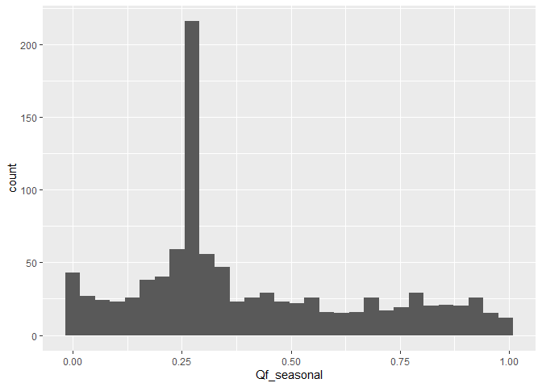
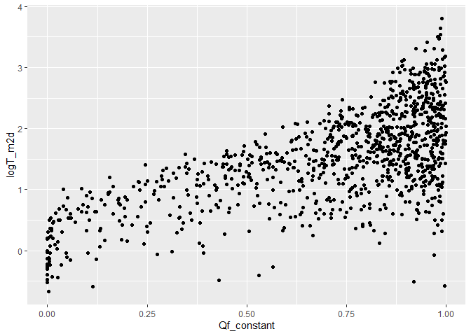

Depletion calculations for temperature paper
================

# Overview

This script is intended to calculate fractional streamflow depletion
(`Qf`) using the Glover model. `Qf` is depletion as a fraction of
pumping rate. To obtain volumetric streamflow depletion (`Qs`), multiply
`Qf` by the pumping rate (`Qw`). `Qs = Qf*Qw`

# Set up workspace

``` r
## load packages
library(streamDepletr)
library(lubridate)
library(tidyverse)
library(sf)
library(patchwork)
options(dplyr.summarise.inform=F)   # suppress summarize info
```

# Prep input data for model

``` r
## times to test
n_yrs <- 50
times <- seq(1, 365*n_yrs, 1)

# for seasonal pumping, start/stop times
times_start <- seq(yday(ymd("2021-05-01")), yday(ymd("2021-05-01"))+365*n_yrs, 365)
times_stop <- seq(yday(ymd("2021-09-30")), yday(ymd("2021-09-30"))+365*n_yrs, 365)

## load well-stream distances
jsko_files <- list.files(file.path("..", "Data", "JasechkoEtAl_Fig2Data"), pattern = ".csv")
for (f in jsko_files){
  # compile all individual states into one data frame
  state <- gsub(".csv", "", f)
  jsko_state_data <- 
    file.path("..", "Data", "JasechkoEtAl_Fig2Data", f) %>% 
    read_csv() %>% 
    mutate(State = state)
  
  if (f == jsko_files[1]){
    jsko_all_states <- jsko_state_data
  } else {
    jsko_all_states <- bind_rows(jsko_all_states, jsko_state_data)
  }
}
```

    ## Rows: 74597 Columns: 13
    ## ── Column specification ────────────────────────────────────────────────────────
    ## Delimiter: ","
    ## dbl (13): COMID, siteID, WellWaterDepth_m, NearestFlowlineDistance_m, NearSt...
    ## 
    ## ℹ Use `spec()` to retrieve the full column specification for this data.
    ## ℹ Specify the column types or set `show_col_types = FALSE` to quiet this message.
    ## Rows: 138141 Columns: 13
    ## ── Column specification ────────────────────────────────────────────────────────
    ## Delimiter: ","
    ## dbl (13): COMID, siteID, WellWaterDepth_m, NearestFlowlineDistance_m, NearSt...
    ## 
    ## ℹ Use `spec()` to retrieve the full column specification for this data.
    ## ℹ Specify the column types or set `show_col_types = FALSE` to quiet this message.
    ## Rows: 49367 Columns: 13
    ## ── Column specification ────────────────────────────────────────────────────────
    ## Delimiter: ","
    ## dbl (13): COMID, siteID, WellWaterDepth_m, NearestFlowlineDistance_m, NearSt...
    ## 
    ## ℹ Use `spec()` to retrieve the full column specification for this data.
    ## ℹ Specify the column types or set `show_col_types = FALSE` to quiet this message.
    ## Rows: 44822 Columns: 13
    ## ── Column specification ────────────────────────────────────────────────────────
    ## Delimiter: ","
    ## dbl (13): COMID, siteID, WellWaterDepth_m, NearestFlowlineDistance_m, NearSt...
    ## 
    ## ℹ Use `spec()` to retrieve the full column specification for this data.
    ## ℹ Specify the column types or set `show_col_types = FALSE` to quiet this message.
    ## Rows: 59229 Columns: 13
    ## ── Column specification ────────────────────────────────────────────────────────
    ## Delimiter: ","
    ## dbl (13): COMID, siteID, WellWaterDepth_m, NearestFlowlineDistance_m, NearSt...
    ## 
    ## ℹ Use `spec()` to retrieve the full column specification for this data.
    ## ℹ Specify the column types or set `show_col_types = FALSE` to quiet this message.
    ## Rows: 145511 Columns: 13
    ## ── Column specification ────────────────────────────────────────────────────────
    ## Delimiter: ","
    ## dbl (13): COMID, siteID, WellWaterDepth_m, NearestFlowlineDistance_m, NearSt...
    ## 
    ## ℹ Use `spec()` to retrieve the full column specification for this data.
    ## ℹ Specify the column types or set `show_col_types = FALSE` to quiet this message.
    ## Rows: 49608 Columns: 13
    ## ── Column specification ────────────────────────────────────────────────────────
    ## Delimiter: ","
    ## dbl (13): COMID, siteID, WellWaterDepth_m, NearestFlowlineDistance_m, NearSt...
    ## 
    ## ℹ Use `spec()` to retrieve the full column specification for this data.
    ## ℹ Specify the column types or set `show_col_types = FALSE` to quiet this message.
    ## Rows: 1461 Columns: 13
    ## ── Column specification ────────────────────────────────────────────────────────
    ## Delimiter: ","
    ## dbl (13): COMID, siteID, WellWaterDepth_m, NearestFlowlineDistance_m, NearSt...
    ## 
    ## ℹ Use `spec()` to retrieve the full column specification for this data.
    ## ℹ Specify the column types or set `show_col_types = FALSE` to quiet this message.
    ## Rows: 17288 Columns: 13
    ## ── Column specification ────────────────────────────────────────────────────────
    ## Delimiter: ","
    ## dbl (13): COMID, siteID, WellWaterDepth_m, NearestFlowlineDistance_m, NearSt...
    ## 
    ## ℹ Use `spec()` to retrieve the full column specification for this data.
    ## ℹ Specify the column types or set `show_col_types = FALSE` to quiet this message.
    ## Rows: 89655 Columns: 13
    ## ── Column specification ────────────────────────────────────────────────────────
    ## Delimiter: ","
    ## dbl (13): COMID, siteID, WellWaterDepth_m, NearestFlowlineDistance_m, NearSt...
    ## 
    ## ℹ Use `spec()` to retrieve the full column specification for this data.
    ## ℹ Specify the column types or set `show_col_types = FALSE` to quiet this message.
    ## Rows: 14101 Columns: 13
    ## ── Column specification ────────────────────────────────────────────────────────
    ## Delimiter: ","
    ## dbl (13): COMID, siteID, WellWaterDepth_m, NearestFlowlineDistance_m, NearSt...
    ## 
    ## ℹ Use `spec()` to retrieve the full column specification for this data.
    ## ℹ Specify the column types or set `show_col_types = FALSE` to quiet this message.
    ## Rows: 3552 Columns: 13
    ## ── Column specification ────────────────────────────────────────────────────────
    ## Delimiter: ","
    ## dbl (13): COMID, siteID, WellWaterDepth_m, NearestFlowlineDistance_m, NearSt...
    ## 
    ## ℹ Use `spec()` to retrieve the full column specification for this data.
    ## ℹ Specify the column types or set `show_col_types = FALSE` to quiet this message.

``` r
## define transmissivity parameters
# from Zell & Sanford (2020) Fig 6f: log(Ts) ~normally distributed from 0-3 m2/d
# use mean of 1.5 and sd of 0.75
logTmean <- 1.5
logTsd <- 0.75

## define storativity parameters
# from Gleeson et al. (2014) Table 1: unconsolidated and sedimentary porosities range from 0.12 to 0.28
# use mean of 0.2 and sd of 0.04
Smean <- 0.2
Ssd <- 0.04
```

# Sample 100 parameter sets

``` r
set.seed(1)
n_iter <- 100
gage_d_sample <- sample(jsko_all_states$NearestFlowlineDistance_m, size = n_iter)
gage_S_sample <- rnorm(n_iter, mean = Smean, sd = Ssd)
gage_logT_sample <- rnorm(n_iter, mean = logTmean, sd = logTsd)

# combine into data frame
df_sample <- data.frame(iter = 1:n_iter,
                        d_m = gage_d_sample,
                        S = gage_S_sample,
                        logT_m2d = gage_logT_sample)

# plot
df_sample |> 
  pivot_longer(-iter, names_to = "parameter", values_to = "value") |> 
  ggplot(aes(x = value)) +
  stat_ecdf() +
  facet_wrap(~parameter, scales = "free")
```

<!-- -->

# Depletion calculation for each gage

``` r
## loop through each parameter set
for (n in 1:n_iter){
  
  ## loop through iterations and calculate depletion
    ## get parameters for this sample
    n_d <- round(gage_d_sample[n], 3)
    n_S <- round(gage_S_sample[n], 3)
    n_Tr <- 10^gage_logT_sample[n]
    
    ## calculate depletion
    # constant pumping
    Qf_constant <- glover(t = times, d = n_d, S = n_S, Tr = n_Tr)
    # plot(times, Qf_constant)
    
    # seasonal pumping (may-sept)
    Qf_seasonal <- intermittent_pumping(t = times, starts = times_start, stops = times_stop, rates = 1, 
                                        method = "glover", d = n_d, S = n_S, Tr = n_Tr)
    # plot(times, Qf_seasonal)
    
    ## summarize data
    daily_iter_depletion <- tibble(iter = n,
                                   day = times,
                                   Qf_constant = round(Qf_constant, 3),
                                   Qf_seasonal = round(Qf_seasonal, 3))
          
    ## compile data frame
    if (n == 1){
      daily_depletion <- daily_iter_depletion
    } else {
      daily_depletion <- bind_rows(daily_depletion, daily_iter_depletion)
    }
  
  ## status update
  print(paste0(n, " of ", n_iter, " complete, ", Sys.time()))
}
```

    ## [1] "1 of 100 complete, 2023-07-20 09:02:47"
    ## [1] "2 of 100 complete, 2023-07-20 09:02:47"
    ## [1] "3 of 100 complete, 2023-07-20 09:02:48"
    ## [1] "4 of 100 complete, 2023-07-20 09:02:48"
    ## [1] "5 of 100 complete, 2023-07-20 09:02:48"
    ## [1] "6 of 100 complete, 2023-07-20 09:02:48"
    ## [1] "7 of 100 complete, 2023-07-20 09:02:48"
    ## [1] "8 of 100 complete, 2023-07-20 09:02:49"
    ## [1] "9 of 100 complete, 2023-07-20 09:02:49"
    ## [1] "10 of 100 complete, 2023-07-20 09:02:49"
    ## [1] "11 of 100 complete, 2023-07-20 09:02:49"
    ## [1] "12 of 100 complete, 2023-07-20 09:02:49"
    ## [1] "13 of 100 complete, 2023-07-20 09:02:50"
    ## [1] "14 of 100 complete, 2023-07-20 09:02:50"
    ## [1] "15 of 100 complete, 2023-07-20 09:02:50"
    ## [1] "16 of 100 complete, 2023-07-20 09:02:50"
    ## [1] "17 of 100 complete, 2023-07-20 09:02:50"
    ## [1] "18 of 100 complete, 2023-07-20 09:02:50"
    ## [1] "19 of 100 complete, 2023-07-20 09:02:51"
    ## [1] "20 of 100 complete, 2023-07-20 09:02:51"
    ## [1] "21 of 100 complete, 2023-07-20 09:02:51"
    ## [1] "22 of 100 complete, 2023-07-20 09:02:51"
    ## [1] "23 of 100 complete, 2023-07-20 09:02:51"
    ## [1] "24 of 100 complete, 2023-07-20 09:02:51"
    ## [1] "25 of 100 complete, 2023-07-20 09:02:52"
    ## [1] "26 of 100 complete, 2023-07-20 09:02:52"
    ## [1] "27 of 100 complete, 2023-07-20 09:02:52"
    ## [1] "28 of 100 complete, 2023-07-20 09:02:52"
    ## [1] "29 of 100 complete, 2023-07-20 09:02:52"
    ## [1] "30 of 100 complete, 2023-07-20 09:02:52"
    ## [1] "31 of 100 complete, 2023-07-20 09:02:52"
    ## [1] "32 of 100 complete, 2023-07-20 09:02:53"
    ## [1] "33 of 100 complete, 2023-07-20 09:02:53"
    ## [1] "34 of 100 complete, 2023-07-20 09:02:53"
    ## [1] "35 of 100 complete, 2023-07-20 09:02:53"
    ## [1] "36 of 100 complete, 2023-07-20 09:02:53"
    ## [1] "37 of 100 complete, 2023-07-20 09:02:53"
    ## [1] "38 of 100 complete, 2023-07-20 09:02:54"
    ## [1] "39 of 100 complete, 2023-07-20 09:02:54"
    ## [1] "40 of 100 complete, 2023-07-20 09:02:54"
    ## [1] "41 of 100 complete, 2023-07-20 09:02:54"
    ## [1] "42 of 100 complete, 2023-07-20 09:02:54"
    ## [1] "43 of 100 complete, 2023-07-20 09:02:54"
    ## [1] "44 of 100 complete, 2023-07-20 09:02:55"
    ## [1] "45 of 100 complete, 2023-07-20 09:02:55"
    ## [1] "46 of 100 complete, 2023-07-20 09:02:55"
    ## [1] "47 of 100 complete, 2023-07-20 09:02:55"
    ## [1] "48 of 100 complete, 2023-07-20 09:02:55"
    ## [1] "49 of 100 complete, 2023-07-20 09:02:55"
    ## [1] "50 of 100 complete, 2023-07-20 09:02:55"
    ## [1] "51 of 100 complete, 2023-07-20 09:02:55"
    ## [1] "52 of 100 complete, 2023-07-20 09:02:56"
    ## [1] "53 of 100 complete, 2023-07-20 09:02:56"
    ## [1] "54 of 100 complete, 2023-07-20 09:02:56"
    ## [1] "55 of 100 complete, 2023-07-20 09:02:56"
    ## [1] "56 of 100 complete, 2023-07-20 09:02:56"
    ## [1] "57 of 100 complete, 2023-07-20 09:02:56"
    ## [1] "58 of 100 complete, 2023-07-20 09:02:56"
    ## [1] "59 of 100 complete, 2023-07-20 09:02:57"
    ## [1] "60 of 100 complete, 2023-07-20 09:02:57"
    ## [1] "61 of 100 complete, 2023-07-20 09:02:57"
    ## [1] "62 of 100 complete, 2023-07-20 09:02:57"
    ## [1] "63 of 100 complete, 2023-07-20 09:02:57"
    ## [1] "64 of 100 complete, 2023-07-20 09:02:58"
    ## [1] "65 of 100 complete, 2023-07-20 09:02:58"
    ## [1] "66 of 100 complete, 2023-07-20 09:02:58"
    ## [1] "67 of 100 complete, 2023-07-20 09:02:58"
    ## [1] "68 of 100 complete, 2023-07-20 09:02:58"
    ## [1] "69 of 100 complete, 2023-07-20 09:02:59"
    ## [1] "70 of 100 complete, 2023-07-20 09:02:59"
    ## [1] "71 of 100 complete, 2023-07-20 09:02:59"
    ## [1] "72 of 100 complete, 2023-07-20 09:02:59"
    ## [1] "73 of 100 complete, 2023-07-20 09:02:59"
    ## [1] "74 of 100 complete, 2023-07-20 09:03:00"
    ## [1] "75 of 100 complete, 2023-07-20 09:03:00"
    ## [1] "76 of 100 complete, 2023-07-20 09:03:00"
    ## [1] "77 of 100 complete, 2023-07-20 09:03:00"
    ## [1] "78 of 100 complete, 2023-07-20 09:03:00"
    ## [1] "79 of 100 complete, 2023-07-20 09:03:01"
    ## [1] "80 of 100 complete, 2023-07-20 09:03:01"
    ## [1] "81 of 100 complete, 2023-07-20 09:03:01"
    ## [1] "82 of 100 complete, 2023-07-20 09:03:01"
    ## [1] "83 of 100 complete, 2023-07-20 09:03:01"
    ## [1] "84 of 100 complete, 2023-07-20 09:03:02"
    ## [1] "85 of 100 complete, 2023-07-20 09:03:02"
    ## [1] "86 of 100 complete, 2023-07-20 09:03:02"
    ## [1] "87 of 100 complete, 2023-07-20 09:03:02"
    ## [1] "88 of 100 complete, 2023-07-20 09:03:02"
    ## [1] "89 of 100 complete, 2023-07-20 09:03:03"
    ## [1] "90 of 100 complete, 2023-07-20 09:03:03"
    ## [1] "91 of 100 complete, 2023-07-20 09:03:03"
    ## [1] "92 of 100 complete, 2023-07-20 09:03:03"
    ## [1] "93 of 100 complete, 2023-07-20 09:03:04"
    ## [1] "94 of 100 complete, 2023-07-20 09:03:04"
    ## [1] "95 of 100 complete, 2023-07-20 09:03:04"
    ## [1] "96 of 100 complete, 2023-07-20 09:03:04"
    ## [1] "97 of 100 complete, 2023-07-20 09:03:04"
    ## [1] "98 of 100 complete, 2023-07-20 09:03:05"
    ## [1] "99 of 100 complete, 2023-07-20 09:03:05"
    ## [1] "100 of 100 complete, 2023-07-20 09:03:05"

# Plot summaries of depletion

``` r
# calculate depletion after 10.5 years (during pumping season)
df_10yr <- 
  daily_depletion |> 
  subset(day == round(365*10.5)) |> 
  left_join(df_sample, by = "iter")

# distribution of Qf
ggplot(df_10yr, aes(x = Qf_constant)) +
  geom_histogram()
```

<!-- -->

``` r
ggplot(df_10yr, aes(x = Qf_seasonal)) +
  geom_histogram()
```

<!-- -->

``` r
# Qf vs parameters
ggplot(df_10yr, aes(x = Qf_constant, y = d_m)) +
  geom_point()
```

<!-- -->

``` r
ggplot(df_10yr, aes(x = Qf_constant, y = S)) +
  geom_point()
```

<!-- -->

``` r
ggplot(df_10yr, aes(x = Qf_constant, y = logT_m2d)) +
  geom_point()
```

<!-- -->

# save output

``` r
## save output
write_csv(daily_depletion, file.path("..", "Data", "TempDepletion_DailyQf.csv"))
write_csv(df_sample, file.path("..", "Data", "TempDepletion_ParameterSample.csv"))
```
