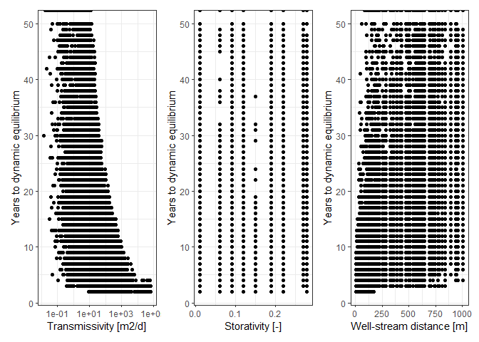
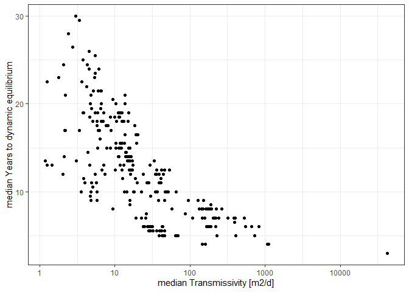
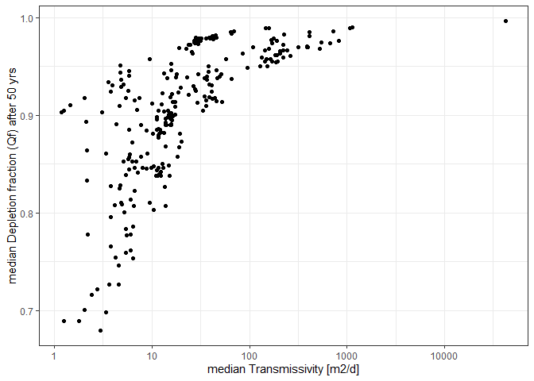
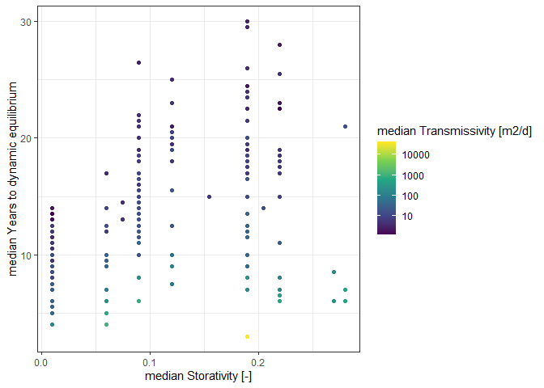
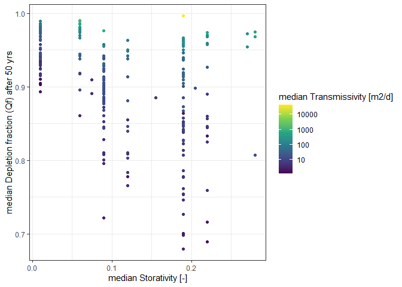
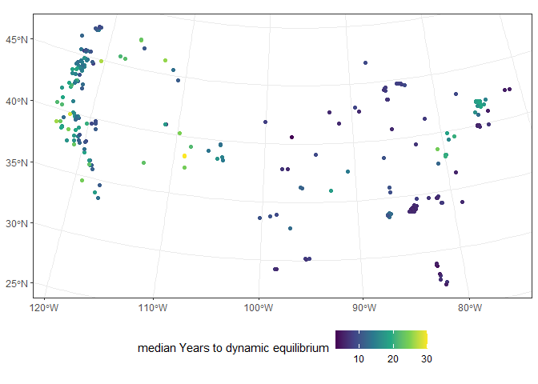
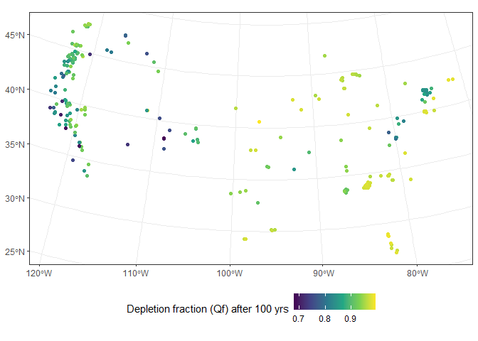
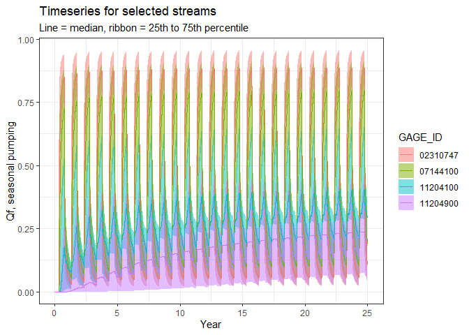

Depletion visualization
================

# Overview

This script visualized output from the `CalculateDepletion.Rmd` script.

# Set up workspace

``` r
## load packages
library(streamDepletr)
library(lubridate)
library(tidyverse)
library(sf)
library(patchwork)
options(dplyr.summarise.inform=F)   # suppress summarize info

# directory to keep stuff that is too big for GitHub
dir_big_files <- "C:/Users/samzipper/OneDrive - The University of Kansas/Research/StreamflowDepletion/DepletionMetrics/data"
```

# Load and compile data

``` r
## load gage shapefile
area_thres_km2 <- 10000  # only analyze gages < 10,000 km2
sf_gages <- 
  file.path("..", "Data", "depletion", "Gages_Depletion.gpkg") %>% 
  st_read() %>% 
  mutate(GAGE_ID = as.numeric(STAID))
```

    ## Reading layer `Gages_Depletion' from data source 
    ##   `C:\Users\samzipper\WorkGits\streamflow_depletion_metrics_replacement\Data\depletion\Gages_Depletion.gpkg' 
    ##   using driver `GPKG'
    ## Simple feature collection with 260 features and 15 fields
    ## Geometry type: POINT
    ## Dimension:     XY
    ## Bounding box:  xmin: -2339840 ymin: 539780.8 xmax: 2001508 ymax: 3009260
    ## Projected CRS: NAD_1983_Albers

``` r
## load all gages summary stats
for (i in 1:length(sf_gages$STAID)){
  usgs_id <- sf_gages$STAID[i]
  
  # load data
  gage_summary <- read_csv(file.path("..", "Data", "depletion", paste0("DepletionFraction_", usgs_id, "_IterationSummary.csv")),
                           col_types = "cidddiid") %>% 
    replace_na(list(eq_yrs_constant = Inf, eq_yrs_seasonal = Inf))
  
  # compile
  if (i == 1){
    all_summary <- gage_summary
  } else {
    all_summary <- bind_rows(all_summary, gage_summary)
  }
}
```

# plot every iteration

``` r
p_eq_Tr <- 
  ggplot(all_summary, aes(y = eq_yrs_constant, x = Tr_m2d)) +
  geom_point() +
  scale_x_continuous(name = "Transmissivity [m2/d]", trans = "log10") +
  scale_y_continuous(name = "Years to dynamic equilibrium") +
  theme_bw()

p_eq_S <- 
  ggplot(all_summary, aes(y = eq_yrs_constant, x = S)) +
  geom_point() +
  scale_x_continuous(name = "Storativity [-]") +
  scale_y_continuous(name = "Years to dynamic equilibrium") +
  theme_bw()

p_eq_d <- 
  ggplot(all_summary, aes(y = eq_yrs_constant, x = dist_m)) +
  geom_point() +
  scale_x_continuous(name = "Well-stream distance [m]") +
  scale_y_continuous(name = "Years to dynamic equilibrium") +
  theme_bw()

p_eq_Tr + p_eq_S + p_eq_d +
  plot_layout(ncol = 3)
```

<!-- -->

# plot summary of median by gage

``` r
## summarize
all_summary_by_gage <-
  all_summary %>% 
  group_by(GAGE_ID) %>% 
  summarize(across(-iter, list(median = median, sd = sd)))

## scatterplots
ggplot(all_summary_by_gage, aes(x = Tr_m2d_median, y = eq_yrs_constant_median)) +
  geom_point() +
  scale_x_continuous(name = "median Transmissivity [m2/d]", trans = "log10") +
  scale_y_continuous(name = "median Years to dynamic equilibrium") +
  theme_bw()
```

<!-- -->

``` r
ggplot(all_summary_by_gage, aes(x = Tr_m2d_median, y = Qf_100yrs_constant_median)) +
  geom_point() +
  scale_x_continuous(name = "median Transmissivity [m2/d]", trans = "log10") +
  scale_y_continuous(name = "median Depletion fraction (Qf) after 50 yrs") +
  theme_bw()
```

<!-- -->

``` r
ggplot(all_summary_by_gage, aes(x = S_median, y = eq_yrs_constant_median, color = Tr_m2d_median)) +
  geom_point() +
  scale_x_continuous(name = "median Storativity [-]") +
  scale_y_continuous(name = "median Years to dynamic equilibrium") +
  scale_color_viridis_c(name = "median Transmissivity [m2/d]", trans = "log10") +
  theme_bw()
```

<!-- -->

``` r
ggplot(all_summary_by_gage, aes(y = Qf_100yrs_constant_median, x = S_median, color = Tr_m2d_median)) +
  geom_point() +
  scale_x_continuous(name = "median Storativity [-]") +
  scale_y_continuous(name = "median Depletion fraction (Qf) after 50 yrs") +
  scale_color_viridis_c(name = "median Transmissivity [m2/d]", trans = "log10") +
  theme_bw()
```

<!-- -->

``` r
## maps
sf_gages <- left_join(sf_gages, all_summary_by_gage, by = c("STAID" = "GAGE_ID"))

ggplot(sf_gages, aes(color = eq_yrs_constant_median)) +
  geom_sf() +
  scale_color_viridis_c(name = "median Years to dynamic equilibrium") +
  theme_bw() +
  theme(legend.position = "bottom")
```

<!-- -->

``` r
ggplot(sf_gages, aes(color = Qf_100yrs_constant_median)) +
  geom_sf() +
  scale_color_viridis_c(name = "Depletion fraction (Qf) after 100 yrs") +
  theme_bw() +
  theme(legend.position = "bottom")
```

<!-- -->

# inspect timeseries of selected streams

``` r
## choose  sample gages: high T high S, high T low S, low T low S, low T high S
gage_inspect <- c("07144100", "02310747", "11204100", "11204900")
all_summary_by_gage[all_summary_by_gage$GAGE_ID %in% gage_inspect, ]
```

    ## # A tibble: 4 x 13
    ##   GAGE_ID  dist_m_median dist_m_sd S_median   S_sd Tr_m2d_median Tr_m2d_sd
    ##   <chr>            <dbl>     <dbl>    <dbl>  <dbl>         <dbl>     <dbl>
    ## 1 02310747          287.      277.     0.06 0.0574        720.      362.  
    ## 2 07144100          287.      277.     0.28 0.0664        545.      154.  
    ## 3 11204100          287.      277.     0.01 0               1.18      3.67
    ## 4 11204900          287.      277.     0.22 0.101           1.25     26.3 
    ## # ... with 6 more variables: eq_yrs_constant_median <dbl>,
    ## #   eq_yrs_constant_sd <dbl>, eq_yrs_seasonal_median <dbl>,
    ## #   eq_yrs_seasonal_sd <dbl>, Qf_100yrs_constant_median <dbl>,
    ## #   Qf_100yrs_constant_sd <dbl>

``` r
# load daily depletion
for (usgs_id in gage_inspect){
  daily_depletion_summary <- read_csv(file.path(dir_big_files, paste0("DepletionFraction_", usgs_id, "_DailySummary.csv"))) %>% 
    mutate(GAGE_ID = usgs_id)
  
  if (usgs_id == gage_inspect[1]){
    daily_depletion_inspect <- daily_depletion_summary
  } else {
    daily_depletion_inspect <- bind_rows(daily_depletion_summary, daily_depletion_inspect)
  }
}
```

    ## Rows: 36500 Columns: 11

    ## -- Column specification --------------------------------------------------------
    ## Delimiter: ","
    ## chr  (1): pumping
    ## dbl (10): day, Qfmean, Qfsd, Qfmin, Qf5, Qf25, Qf50, Qf75, Qf95, Qfmax

    ## 
    ## i Use `spec()` to retrieve the full column specification for this data.
    ## i Specify the column types or set `show_col_types = FALSE` to quiet this message.

    ## Rows: 36500 Columns: 11

    ## -- Column specification --------------------------------------------------------
    ## Delimiter: ","
    ## chr  (1): pumping
    ## dbl (10): day, Qfmean, Qfsd, Qfmin, Qf5, Qf25, Qf50, Qf75, Qf95, Qfmax

    ## 
    ## i Use `spec()` to retrieve the full column specification for this data.
    ## i Specify the column types or set `show_col_types = FALSE` to quiet this message.

    ## Rows: 36500 Columns: 11

    ## -- Column specification --------------------------------------------------------
    ## Delimiter: ","
    ## chr  (1): pumping
    ## dbl (10): day, Qfmean, Qfsd, Qfmin, Qf5, Qf25, Qf50, Qf75, Qf95, Qfmax

    ## 
    ## i Use `spec()` to retrieve the full column specification for this data.
    ## i Specify the column types or set `show_col_types = FALSE` to quiet this message.

    ## Rows: 36500 Columns: 11

    ## -- Column specification --------------------------------------------------------
    ## Delimiter: ","
    ## chr  (1): pumping
    ## dbl (10): day, Qfmean, Qfsd, Qfmin, Qf5, Qf25, Qf50, Qf75, Qf95, Qfmax

    ## 
    ## i Use `spec()` to retrieve the full column specification for this data.
    ## i Specify the column types or set `show_col_types = FALSE` to quiet this message.

``` r
daily_depletion_inspect %>% 
  subset(pumping == "constant" & day <= 25*365) %>% 
  ggplot(aes(x = day/365)) +
  geom_ribbon(aes(ymin = Qf25, ymax = Qf75, fill = GAGE_ID), alpha = 0.5) +
  geom_line(aes(y = Qf50, color = GAGE_ID)) +
  scale_x_continuous(name = "Year") +
  scale_y_continuous(name = "Qf, continuous pumping") +
  labs(title = "Timeseries for selected streams", subtitle = "Line = median, ribbon = 25th to 75th percentile") +
  theme_bw()
```

<!-- -->

``` r
daily_depletion_inspect %>% 
  subset(pumping == "seasonal" & day <= 25*365) %>% 
  ggplot(aes(x = day/365)) +
  geom_ribbon(aes(ymin = Qf25, ymax = Qf75, fill = GAGE_ID), alpha = 0.5) +
  geom_line(aes(y = Qf50, color = GAGE_ID)) +
  scale_x_continuous(name = "Year") +
  scale_y_continuous(name = "Qf, seasonal pumping") +
  labs(title = "Timeseries for selected streams", subtitle = "Line = median, ribbon = 25th to 75th percentile") +
  theme_bw()
```

<!-- -->
